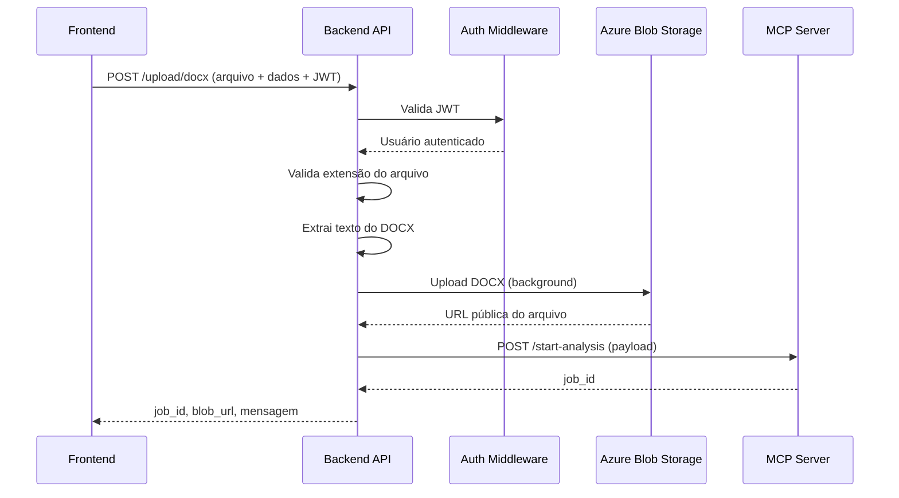

# Fluxo da API: Upload de Arquivo DOCX

Este documento apresenta de forma objetiva o fluxo principal do backend, detalhando o caminho da requisição desde o frontend até a geração e retorno do relatório via MCP Server. O foco está nos pontos críticos para o funcionamento da solução, com referências diretas ao código responsável em cada etapa.

## 1. Sequência Detalhada do Fluxo de Upload

1. **Frontend** envia uma requisição HTTP POST para `/upload/docx`, contendo:
   - Arquivo DOCX (campo `file`)
   - Dados do projeto (`projeto`), nome da análise (`analysis_name`), tipo de análise (`analysis_type`)
   - Header `Authorization: Bearer <JWT>`

2. **Backend API** recebe a requisição e executa as etapas:
   - Valida o token JWT via middleware de autenticação (Azure AD)
   - Extrai o usuário autenticado do token
   - Valida extensão do arquivo (apenas `.docx` permitido)
   - Extrai texto do arquivo DOCX
   - Salva o arquivo no Azure Blob Storage (em background)
   - Monta o payload para o MCP Server com dados do projeto, usuário, texto extraído e parâmetros da análise
   - Chama o MCP Server para iniciar a análise
   - Recebe o `job_id` do MCP Server
   - Retorna ao frontend: `job_id`, URL do arquivo no blob, mensagem de sucesso

## 2. Diagrama Mermaid: Sequência de Interação



## 3. Descrição das Etapas Críticas com Código Responsável

### a) Validação JWT
- **Arquivo:** [`backend/app/middleware/auth_middleware.py`](../app/middleware/auth_middleware.py)
- **Função:** `get_current_user(request: Request)`
- **Resumo:** Intercepta o header `Authorization`, valida o token JWT e extrai o usuário autenticado.
- **Exemplo de código:**
```text
  python
  def get_current_user(request: Request) -> AzureADTokenData:
      auth: str = request.headers.get("Authorization")
      scheme, param = get_authorization_scheme_param(auth)
      if not auth or scheme.lower() != "bearer":
          raise HTTPException(status_code=status.HTTP_401_UNAUTHORIZED, detail="Cabeçalho Authorization ausente ou inválido.")
      return azure_ad_service.validate_token(param)
  ```
- **Validação do token:**
  - **Arquivo:** [`backend/app/services/azure_ad_service.py`](../app/services/azure_ad_service.py)
  - **Função:** `AzureADService.validate_token(token: str)`
  - **Trecho relevante:**
    python
    claims = jwt.decode(token, options={"verify_signature": False, "verify_exp": True}, algorithms=["RS256", "HS256"])
    usuario_executor = claims.get("preferred_username") or claims.get("email") or claims.get("upn")
    if not usuario_executor:
        raise HTTPException(status_code=status.HTTP_401_UNAUTHORIZED, detail="usuario_executor não encontrado no token Azure AD.")
    return AzureADTokenData(usuario_executor=usuario_executor, claims=claims)
    

### b) Validação de Extensão do Arquivo
- **Arquivo:** [`backend/app/api/upload.py`](../app/api/upload.py)
- **Função:** `upload_docx(...)`
- **Trecho relevante:**
  python
  if not file.filename.lower().endswith(".docx"):
      raise HTTPException(status_code=400, detail="Apenas arquivos .docx são permitidos.")
  

### c) Extração de Texto do DOCX
- **Arquivo:** [`backend/app/services/docx_parser_service.py`](../app/services/docx_parser_service.py)
- **Função:** `extract_text_from_docx(file: UploadFile) -> str`
- **Trecho relevante:**
  python
  async def extract_text_from_docx(file: UploadFile) -> str:
      file.file.seek(0)
      doc_bytes = await file.read()
      doc_stream = io.BytesIO(doc_bytes)
      document = Document(doc_stream)
      full_text = []
      for para in document.paragraphs:
          full_text.append(para.text)
      return '\n'.join(full_text)
  

### d) Upload para Azure Blob Storage
- **Arquivo:** [`backend/app/services/blob_storage_service.py`](../app/services/blob_storage_service.py)
- **Função:** `upload_docx_to_blob(file, blob_folder, blob_filename, background_tasks)`
- **Trecho relevante:**
  python
  async def upload_docx_to_blob(file: UploadFile, blob_folder: str, blob_filename: str, background_tasks: BackgroundTasks) -> str:
      def upload_task():
          _sync_upload(file, blob_folder, blob_filename)
      background_tasks.add_task(upload_task)
      blob_path = f"{blob_folder}/{blob_filename}"
      blob_client = container_client.get_blob_client(blob_path)
      return blob_client.url
  

### e) Montagem do Payload e Comunicação com MCP Server
- **Arquivo:** [`backend/app/services/mcp_client_service.py`](../app/services/mcp_client_service.py)
- **Função:** `MCPClientService.start_analysis(payload)`
- **Trecho relevante:**

```text
  python
  async def start_analysis(self, payload: MCPStartAnalysisPayload) -> MCPStartAnalysisResponse:
      url = f"{self.get_mcp_endpoint(payload.analysis_type)}/start-analysis"
      async with httpx.AsyncClient(timeout=30) as client:
          response = await client.post(
              url,
              json=payload.dict(),
              headers={"Content-Type": "application/json"}
          )
          response.raise_for_status()
          data = response.json()
          return MCPStartAnalysisResponse(**data)
  ```text

### f) Resposta ao Frontend
- **Arquivo:** [`backend/app/api/upload.py`](../app/api/upload.py)
- **Função:** `upload_docx(...)`
- **Trecho relevante:**
  python
  return UploadDocxResponse(job_id=job_id, blob_url=blob_url, message="Arquivo recebido, salvo e análise iniciada com sucesso.")
  

## 4. Exemplos de Payloads

### a) Requisição (Frontend → Backend)

**POST /upload/docx**
http
POST /upload/docx
Authorization: Bearer <JWT_TOKEN>
Content-Type: multipart/form-data

file: <arquivo.docx>
projeto: "ProjetoX"
analysis_name: "Reuniao_01"
analysis_type: "criacao_epicos_azure_devops"


### b) Payload enviado para MCP Server
```json
{
  "analysis_type": "criacao_epicos_azure_devops",
  "instrucoes_extras": "Texto extraído do docx...",
  "projeto": "ProjetoX",
  "analysis_name": "Reuniao_01",
  "usuario_executor": "user@example.com"
}
```

### c) Resposta (Backend → Frontend)

```json
{
  "job_id": "abc-123",
  "blob_url": "https://blobstorage.azure.com/user/projetoX/arquivos_recebidos/docx/Reuniao_01.docx",
  "message": "Arquivo recebido, salvo e análise iniciada com sucesso."
}
```

## 5. Códigos de Status HTTP e Tratamento de Erros

```text
| Etapa                      | Código | Mensagem de Erro                                   |
|---------------------------|--------|---------------------------------------------------|
| Validação JWT             | 401    | Token JWT inválido ou ausente                     |
| Validação de extensão     | 400    | Apenas arquivos .docx são permitidos              |
| Extração de texto         | 400    | Erro ao extrair texto do docx                     |
| Upload para Blob Storage  | 500    | Erro ao fazer upload do arquivo para o Blob       |
| Comunicação MCP Server    | 502    | Erro ao comunicar com MCP Server                  |
| Sucesso                   | 200    | job_id, blob_url, mensagem                        |
```
## 6. Resumo do Funcionamento

O endpoint `/upload/docx` implementa um fluxo seguro e eficiente para receber arquivos DOCX do frontend, validar o usuário e o arquivo, extrair o texto, armazenar o arquivo no Azure Blob Storage e acionar o MCP Server para análise. Todo o processo é protegido por autenticação JWT e possui tratamento robusto de erros para garantir confiabilidade na comunicação entre os componentes. Cada etapa está claramente mapeada para funções e arquivos do código, facilitando manutenção e auditoria.
