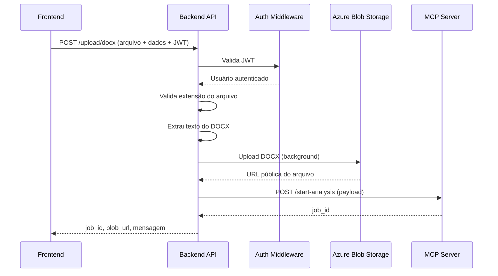

# Fluxo da API: Upload de Arquivo DOCX

Este documento detalha o funcionamento do endpoint principal de upload de arquivos DOCX, desde o recebimento da requisição pelo backend até o retorno da resposta ao frontend, incluindo processamento, comunicação com o MCP Server e tratamento de erros.

## 1. Sequência Detalhada do Fluxo de Upload

1. **Frontend** envia uma requisição HTTP POST para `/upload/docx`, contendo:
   - Arquivo DOCX (campo `file`)
   - Dados do projeto (`projeto`), nome da análise (`analysis_name`), tipo de análise (`analysis_type`)
   - Header `Authorization: Bearer <JWT>`

2. **Backend API** recebe a requisição e executa as etapas:
   - Valida o token JWT via middleware de autenticação (Azure AD)
   - Extrai o usuário autenticado do token
   - Valida extensão do arquivo (apenas `.docx` permitido)
   - Extrai texto do arquivo DOCX
   - Salva o arquivo no Azure Blob Storage (em background)
   - Monta o payload para o MCP Server com dados do projeto, usuário, texto extraído e parâmetros da análise
   - Chama o MCP Server para iniciar a análise
   - Recebe o `job_id` do MCP Server
   - Retorna ao frontend: `job_id`, URL do arquivo no blob, mensagem de sucesso

## 2. Diagrama Mermaid: Sequência de Interação



## 3. Descrição das Etapas Críticas

### a) Validação JWT
- O middleware intercepta a requisição e valida o token JWT.
- Se inválido ou ausente, retorna HTTP 401 Unauthorized.
- Usuário autenticado é extraído para uso nos próximos passos.

### b) Validação de Extensão
- Apenas arquivos com extensão `.docx` são aceitos.
- Se outro formato, retorna HTTP 400 Bad Request.

### c) Extração de Texto
- O serviço lê o arquivo DOCX e extrai todo o texto.
- Se falhar, retorna HTTP 400 Bad Request com mensagem de erro.

### d) Upload para Blob Storage
- O arquivo é salvo no Azure Blob Storage em background.
- O caminho segue o padrão: `usuario_executor/projeto/arquivos_recebidos/docx/analysis_name.docx`
- A URL pública do arquivo é gerada e retornada.
- Se falhar, retorna HTTP 500 Internal Server Error.

### e) Chamada ao MCP Server
- O backend monta o payload com:
  - `analysis_type`, `instrucoes_extras` (texto extraído), `projeto`, `analysis_name`, `usuario_executor`
- Envia POST para o endpoint `/start-analysis` do MCP Server.
- Se MCP Server responder com erro, retorna HTTP 502 Bad Gateway.

### f) Retorno ao Frontend
- Resposta contém:
  - `job_id` (identificador da análise no MCP)
  - `blob_url` (URL pública do arquivo DOCX)
  - `message` (mensagem de sucesso)

## 4. Exemplos de Payloads

### a) Requisição (Frontend → Backend)

**POST /upload/docx**
```texte
Form Data:
http
file: <arquivo.docx>
projeto: "ProjetoX"
analysis_name: "Reuniao_01"
analysis_type: "criacao_epicos_azure_devops"

Headers:
http
Authorization: Bearer <JWT_TOKEN>
```

### b) Payload enviado para MCP Server

```text
{
  "analysis_type": "criacao_epicos_azure_devops",
  "instrucoes_extras": "Texto extraído do docx...",
  "projeto": "ProjetoX",
  "analysis_name": "Reuniao_01",
  "usuario_executor": "user@example.com"
}
```

### c) Resposta (Backend → Frontend)

```text
{
  "job_id": "abc-123",
  "blob_url": "https://blobstorage.azure.com/user/projetoX/arquivos_recebidos/docx/Reuniao_01.docx",
  "message": "Arquivo recebido, salvo e análise iniciada com sucesso."
}
```

## 5. Códigos de Status HTTP e Tratamento de Erros
```text
| Etapa                      | Código | Mensagem de Erro                                   |
|---------------------------|--------|---------------------------------------------------|
| Validação JWT             | 401    | Token JWT inválido ou ausente                     |
| Validação de extensão     | 400    | Apenas arquivos .docx são permitidos              |
| Extração de texto         | 400    | Erro ao extrair texto do docx                     |
| Upload para Blob Storage  | 500    | Erro ao fazer upload do arquivo para o Blob       |
| Comunicação MCP Server    | 502    | Erro ao comunicar com MCP Server                  |
| Sucesso                   | 200    | job_id, blob_url, mensagem                        |
```
## 6. Resumo do Funcionamento

O endpoint `/upload/docx` implementa um fluxo seguro e eficiente para receber arquivos DOCX do frontend, validar o usuário e o arquivo, extrair o texto, armazenar o arquivo no Azure Blob Storage e acionar o MCP Server para análise. Todo o processo é protegido por autenticação JWT e possui tratamento robusto de erros para garantir confiabilidade na comunicação entre os componentes.
