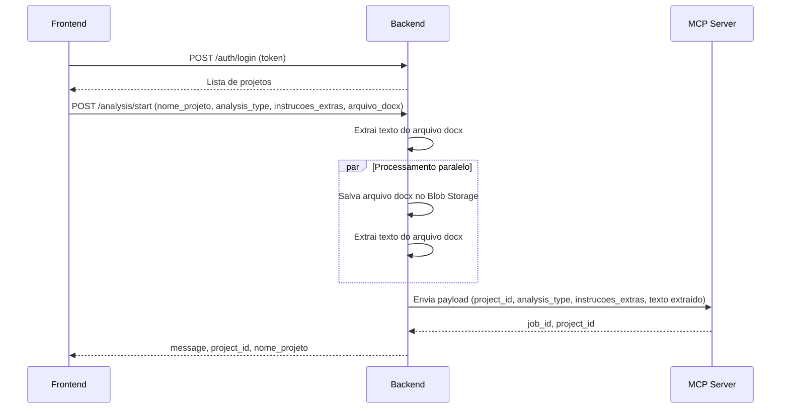
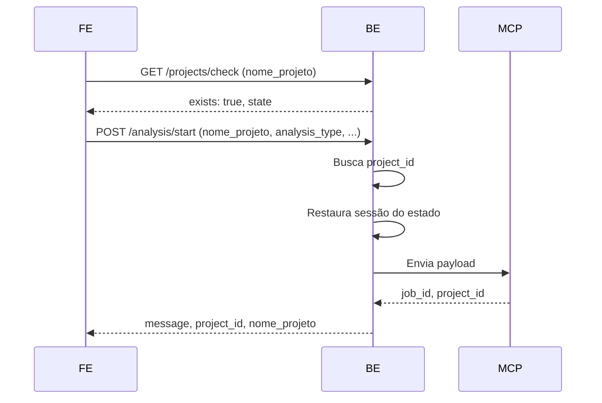
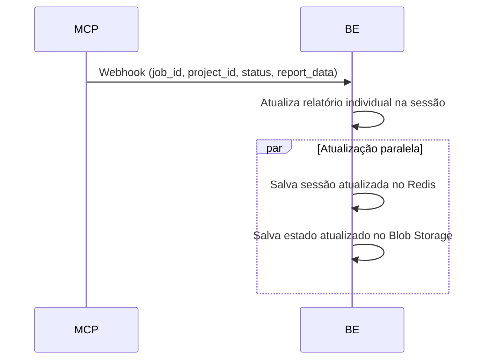
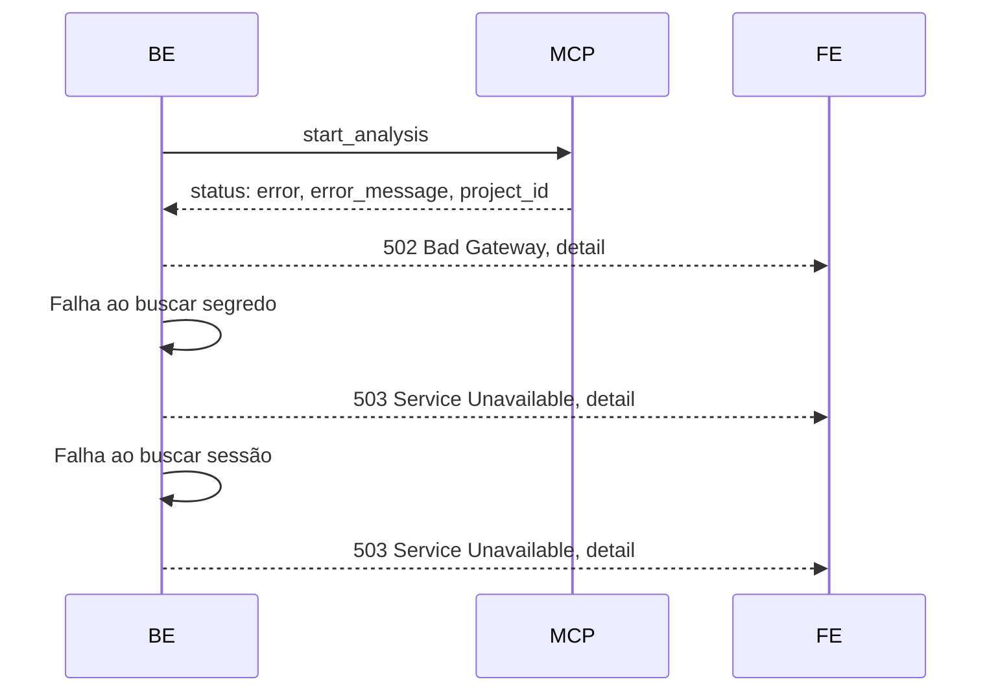

# Índice

- [1. Introdução](#1-introdução)
- [2. Autenticação e Configuração](#2-autenticação-e-configuração)
  - [2.1 Obtenção de Configuração Azure AD (GET /auth/config)](#21-obtenção-de-configuração-azure-ad-get-authconfig)
  - [2.2 Login e Obtenção de Projetos (POST /auth/login)](#22-login-e-obtenção-de-projetos-post-authlogin)
- [3. Gerenciamento de Projetos](#3-gerenciamento-de-projetos)
  - [3.1 Verificar Existência de Projeto (GET /projects/check)](#31-verificar-existência-de-projeto-get-projectscheck)
  - [3.2 Listar Projetos do Usuário (GET /projects/list)](#32-listar-projetos-do-usuário-get-projectslist)
- [4. Início de Análise](#4-início-de-análise)
  - [4.1 Iniciar Análise (POST /analysis/start)](#41-iniciar-análise-post-analysisstart)
- [5. Gerenciamento de Sessão e Relatórios](#5-gerenciamento-de-sessão-e-relatórios)
  - [5.1 Consultar Relatórios do Projeto (GET /session/project/{project_id}/reports)](#51-consultar-relatórios-do-projeto-get-sessionprojectproject_idreports)
  - [5.2 Atualizar Relatório Individual (PUT /session/project/{project_id}/report)](#52-atualizar-relatório-individual-put-sessionprojectproject_idreport)
  - [5.3 Salvar Estado do Projeto (POST /session/project/{project_id}/save-state)](#53-salvar-estado-do-projeto-post-sessionprojectproject_idsave-state)
  - [5.4 Listar Arquivos DOCX do Projeto (GET /session/project/{project_id}/docx-files)](#54-listar-arquivos-docx-do-projeto-get-sessionprojectproject_iddocx-files)
- [6. Webhooks MCP → Backend](#6-webhooks-mcp--backend)
  - [6.1 Webhook de Progresso/Conclusão/Erro (POST /webhooks/mcp)](#61-webhook-de-progresso-conclusão-erro-post-webhooksmcp)
- [7. Tratamento de Erros](#7-tratamento-de-erros)
- [8. Fluxo Completo de Comunicação Frontend ↔ Backend ↔ MCP](#8-fluxo-completo-de-comunicação-frontend-↔-backend-↔-mcp)
- [9. Boas Práticas de Integração](#9-boas-práticas-de-integração)

---

# 1. Introdução

Este documento apresenta exemplos detalhados de payloads, headers, respostas e fluxos para todas as requisições da API do backend Peers CodeAI. O objetivo é orientar o frontend sobre como se comunicar corretamente com a API, como enviar e ler dados, e como interpretar as respostas e erros.

A comunicação segue o fluxo: **Frontend ↔ Backend ↔ MCP**. O backend orquestra autenticação, gerenciamento de projetos, upload de arquivos, envio de análises ao MCP, atualização de relatórios e persistência de estado.

---

# 2. Autenticação e Configuração

## 2.1 Obtenção de Configuração Azure AD (GET /auth/config)

Obtém as informações necessárias para autenticação via Azure AD no frontend.

**Requisição:**

GET /auth/config HTTP/1.1

**Resposta:**

{
  "client_id": "<client-id>",
  "tenant_id": "<tenant-id>",
  "authority": "https://login.microsoftonline.com/<tenant-id>",
  "redirect_uri": "http://localhost:3000/auth/callback",
  "scope": "User.Read"
}

**Explicação:**
- Use esses dados para configurar a biblioteca MSAL.js no frontend e obter o token JWT do Azure AD.

---

## 2.2 Login e Obtenção de Projetos (POST /auth/login)

Autentica o usuário (valida o token JWT enviado pelo frontend) e retorna informações do usuário e lista de projetos.

**Requisição:**

POST /auth/login HTTP/1.1
Authorization: Bearer <token>
Content-Type: application/json

**Resposta:**

{
  "user_info": {
    "usuario_executor": "user@example.com",
    "sub": "uuid",
    "name": "Nome do Usuário",
    "email": "user@example.com",
    "roles": ["admin"]
  },
  "projects": [
    {
      "nome_projeto": "ProjetoNovo",
      "analysis_type": "criacao_epicos_azure_devops",
      "created_at": "2024-06-01T12:00:00Z",
      "last_saved_to_blob": "2024-06-01T12:30:00Z",
      "project_id": "projeto-uuid-123"
    }
  ]
}

**Explicação:**
- O token JWT deve ser obtido via Azure AD e enviado no header Authorization.
- O backend valida o token, extrai o usuário e retorna os projetos associados.

---

# 3. Gerenciamento de Projetos

## 3.1 Verificar Existência de Projeto (GET /projects/check)

Verifica se um projeto existe para o usuário autenticado.

**Requisição:**

GET /projects/check?nome_projeto=ProjetoNovo HTTP/1.1
Authorization: Bearer <token>

**Resposta (projeto existe):**

{
  "exists": true,
  "state": {
    "usuario_executor": "user@example.com",
    "nome_projeto": "ProjetoNovo",
    "analysis_type": "criacao_epicos_azure_devops",
    "created_at": "2024-06-01T12:00:00Z",
    "last_saved_to_blob": "2024-06-01T12:30:00Z",
    "epicos_report": [{ "id": 1, "titulo": "Como usuário..." }],
    "features_report": [{ "id": 1, "nome": "Login" }],
    "times_descricao_report": null,
    "alocacao_times_report": null,
    "premissas_riscos_report": null,
    "docx_files": ["https://.../arquivo1.docx"],
    "project_id": "projeto-uuid-123"
  }
}

**Resposta (projeto não existe):**

{
  "exists": false
}

**Explicação:**
- Envie o nome do projeto como query param. O backend converte para `project_id` internamente.
- Se existir, retorna o estado completo do projeto.

---

## 3.2 Listar Projetos do Usuário (GET /projects/list)

Lista todos os projetos do usuário autenticado.

**Requisição:**

GET /projects/list HTTP/1.1
Authorization: Bearer <token>

**Resposta:**

[
  {
    "nome_projeto": "ProjetoNovo",
    "analysis_type": "criacao_epicos_azure_devops",
    "created_at": "2024-06-01T12:00:00Z",
    "last_saved_to_blob": "2024-06-01T12:30:00Z",
    "project_id": "projeto-uuid-123"
  },
  ...
]

**Explicação:**
- Use este endpoint para popular listas de projetos no frontend.

---

# 4. Início de Análise

## 4.1 Iniciar Análise (POST /analysis/start)

Inicia uma análise enviando um arquivo DOCX (opcional) e/ou instruções extras.

**Requisição (com arquivo DOCX):**

POST /analysis/start HTTP/1.1
Authorization: Bearer <token>
Content-Type: multipart/form-data

nome_projeto=ProjetoNovo
analysis_type=criacao_epicos_azure_devops
instrucoes_extras=Este é um comentário adicional do usuário.
arquivo_docx=<arquivo.docx>

**Requisição (sem arquivo DOCX, apenas instruções):**

POST /analysis/start HTTP/1.1
Authorization: Bearer <token>
Content-Type: multipart/form-data

nome_projeto=ProjetoNovo
analysis_type=criacao_epicos_azure_devops
instrucoes_extras=Descreva o sistema de login.

**Resposta:**

{
  "message": "Análise solicitada com sucesso ao agente.",
  "project_id": "projeto-uuid-123",
  "nome_projeto": "ProjetoNovo"
}

**Explicação:**
- `nome_projeto` e `analysis_type` são obrigatórios.
- Envie `arquivo_docx` como arquivo (opcional) e/ou `instrucoes_extras` (opcional, mas ao menos um dos dois é obrigatório).
- O backend extrai o texto do DOCX, salva o arquivo no Blob Storage em paralelo e envia o texto ao MCP.
- O campo `project_id` é retornado e deve ser usado em todas as requisições futuras relacionadas ao projeto.

---

# 5. Gerenciamento de Sessão e Relatórios

## 5.1 Consultar Relatórios do Projeto (GET /session/project/{project_id}/reports)

Obtém todos os relatórios do projeto.

**Requisição:**

GET /session/project/projeto-uuid-123/reports HTTP/1.1
Authorization: Bearer <token>

**Resposta:**

{
  "epicos_report": [{ "id": 1, "titulo": "Como usuário..." }],
  "features_report": [{ "id": 1, "nome": "Login" }],
  "times_descricao_report": null,
  "alocacao_times_report": null,
  "premissas_riscos_report": null,
  "project_id": "projeto-uuid-123",
  "nome_projeto": "ProjetoNovo"
}

**Explicação:**
- Cada relatório é retornado em seu campo individual. O valor pode ser lista, null ou vazio.

---

## 5.2 Atualizar Relatório Individual (PUT /session/project/{project_id}/report)

Atualiza um relatório específico do projeto.

**Requisição:**

PUT /session/project/projeto-uuid-123/report HTTP/1.1
Authorization: Bearer <token>
Content-Type: application/json

{
  "report_data": {
    "features_report": [
      { "id": 101, "nome": "Configurar App Registration Azure", "descricao": "Criar app no entra ID" }
    ]
  }
}

**Resposta:**

{
  "status": "ok",
  "project_id": "projeto-uuid-123",
  "nome_projeto": "ProjetoNovo"
}

**Explicação:**
- O campo `report_data` deve ser um dicionário com **exatamente uma** chave de relatório (`epicos_report`, `features_report`, etc), cujo valor é uma lista.
- Atualiza apenas o relatório informado, mantendo os demais inalterados.

---

## 5.3 Salvar Estado do Projeto (POST /session/project/{project_id}/save-state)

Salva o estado atual do projeto no Blob Storage.

**Requisição:**

POST /session/project/projeto-uuid-123/save-state HTTP/1.1
Authorization: Bearer <token>

**Resposta:**

{
  "blob_url": "https://.../estado_20240601T123000Z.json",
  "project_id": "projeto-uuid-123",
  "nome_projeto": "ProjetoNovo"
}

**Explicação:**
- Use para forçar o salvamento do estado atual do projeto no Blob Storage.

---

## 5.4 Listar Arquivos DOCX do Projeto (GET /session/project/{project_id}/docx-files)

Lista todos os arquivos DOCX enviados para o projeto.

**Requisição:**

GET /session/project/projeto-uuid-123/docx-files HTTP/1.1
Authorization: Bearer <token>

**Resposta:**

{
  "docx_files": ["https://.../arquivo1.docx", "https://.../arquivo2.docx"],
  "project_id": "projeto-uuid-123",
  "nome_projeto": "ProjetoNovo"
}

---

# 6. Webhooks MCP → Backend

## 6.1 Webhook de Progresso/Conclusão/Erro (POST /webhooks/mcp)

Recebe atualizações do MCP sobre o progresso, conclusão ou erro de uma análise.

**Requisição (progresso):**

POST /webhooks/mcp HTTP/1.1
Content-Type: application/json

{
  "job_id": "123456",
  "project_id": "projeto-uuid-123",
  "status": "in_progress",
  "progress": 40,
  "report_data": {
    "features_report": [
      { "id": 101, "nome": "Configurar App Registration Azure", "descricao": "Criar app no entra ID" }
    ]
  }
}

**Requisição (conclusão):**

POST /webhooks/mcp HTTP/1.1
Content-Type: application/json

{
  "job_id": "123456",
  "project_id": "projeto-uuid-123",
  "status": "done",
  "report_data": {
    "features_report": [
      { "id": 101, "nome": "Configurar App Registration Azure", "descricao": "Criar app no entra ID" },
      { "id": 102, "nome": "Middleware de Validação JWT", "descricao": "Validar token no backend Python" }
    ]
  }
}

**Requisição (erro):**

POST /webhooks/mcp HTTP/1.1
Content-Type: application/json

{
  "job_id": "123456",
  "project_id": "projeto-uuid-123",
  "status": "error",
  "error_type": "timeout",
  "error_message": "Tempo limite excedido ao processar análise."
}

**Resposta:**

{
  "status": "ok",
  "project_id": "projeto-uuid-123",
  "nome_projeto": "ProjetoNovo"
}

**Explicação:**
- O campo `report_data` deve ser um dicionário com uma única chave de relatório, cujo valor é uma lista.
- O backend atualiza apenas o relatório correspondente no Redis.
- Em caso de erro, apenas loga o erro e retorna status ok.

---

# 7. Tratamento de Erros

A API retorna códigos de status HTTP padronizados. Exemplos:

- **400 Bad Request:** Parâmetros ausentes, formato inválido, ou payload inconsistente.
- **401 Unauthorized:** Token ausente, inválido ou expirado.
- **403 Forbidden:** IP não autorizado.
- **404 Not Found:** Projeto ou recurso não encontrado.
- **500 Internal Server Error:** Erro inesperado no backend.
- **502 Bad Gateway:** Falha na comunicação com o MCP.
- **503 Service Unavailable:** Falha crítica de infraestrutura (ex: Key Vault, Redis indisponível).

**Exemplo de erro:**

{
  "detail": "Token Azure AD expirado."
}

**Como lidar:**
- Sempre trate erros no frontend exibindo mensagens amigáveis ao usuário.
- Para 401/403, redirecione para login.
- Para 502/503, oriente o usuário a tentar novamente mais tarde.

---

# 8. Fluxo Completo de Comunicação Frontend ↔ Backend ↔ MCP

## 8.1 Novo Projeto

## 8.2 Projeto Existente

## 8.3 Atualização de Relatório via Webhook

## 8.4 Fluxo de Erro e Recuperação

---

# 9. Boas Práticas de Integração

- Sempre utilize o campo `project_id` retornado nas respostas para identificar projetos em todas as requisições subsequentes.
- Use polling periódico para consultar relatórios (`GET /session/project/{project_id}/reports`) enquanto o MCP processa a análise.
- Trate timeouts e erros de rede com lógica de retry exponencial.
- Não dependa de campos obsoletos como `projeto`, `comentario_usuario` ou `docx_blob_url`.
- Sempre envie o token JWT no header Authorization.
- Para uploads, envie arquivos via multipart/form-data.
- Em caso de erro, exiba mensagens amigáveis e oriente o usuário a tentar novamente.
- O backend pode retornar campos de relatório como `null`, lista vazia ou preenchida, dependendo do progresso da análise.
- O campo `nome_projeto` é aceito como referência humana, mas o backend sempre converte para `project_id` internamente.
- O upload de DOCX e extração de texto são processados em paralelo para melhor performance.
- O backend salva automaticamente o estado do projeto em Blob Storage após cada atualização relevante.

---
