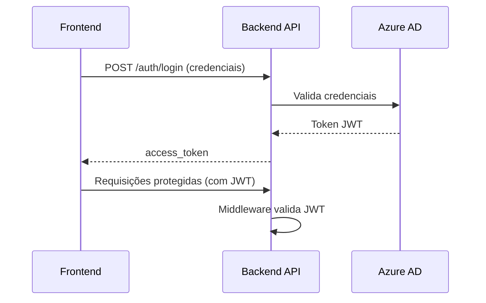

# Arquitetura e Fluxo da Solução Backend

## Visão Geral
Este documento apresenta o funcionamento essencial do backend, detalhando o fluxo principal desde o recebimento da requisição do frontend até a geração e retorno do relatório via MCP Server. O objetivo é fornecer uma visão clara e objetiva dos pontos críticos para operação da solução.

## Fluxo Principal: Upload e Análise de Arquivo DOCX

1. **Frontend** envia requisição HTTP POST para o endpoint `/upload/docx` do backend, contendo o arquivo DOCX e dados do projeto/usuário.
2. **Backend API** recebe a requisição, valida o token JWT do usuário (autenticação via Azure AD).
3. O arquivo DOCX é processado pelo serviço de extração de texto.
4. O arquivo é salvo no Azure Blob Storage, e a URL pública é gerada.
5. O backend monta o payload com informações do projeto, usuário, texto extraído e aciona o MCP Server para iniciar a análise.
6. O MCP Server processa e retorna o `job_id` da análise.
7. O backend responde ao frontend com o `job_id`, URL do arquivo e mensagem de sucesso.

### Diagrama Mermaid: Fluxo de Upload e Análise
mermaid
sequenceDiagram
    participant FE as Frontend
    participant API as Backend API
    participant MW as Auth Middleware
    participant Blob as Azure Blob Storage
    participant MCP as MCP Server

    FE->>API: POST /upload/docx (arquivo + dados)
    API->>MW: Valida JWT
    MW-->>API: Usuário autenticado
    API->>Blob: Upload DOCX
    Blob-->>API: URL pública do arquivo
    API->>API: Extrai texto do DOCX
    API->>MCP: POST /start-analysis (payload)
    MCP-->>API: job_id
    API-->>FE: job_id, blob_url, mensagem

## Fluxo de Autenticação

1. **Frontend** envia credenciais para `/auth/login`.
2. **Backend** autentica via Azure AD e retorna um token JWT.
3. Nas requisições protegidas, o JWT é validado pelo middleware antes do processamento.

### Diagrama Mermaid: Autenticação

## Componentes Principais
- **API Routers**: Endpoints de autenticação e upload.
- **Auth Middleware**: Validação do token JWT em cada requisição.
- **Blob Storage Service**: Upload e gerenciamento de arquivos DOCX.
- **DOCX Parser Service**: Extração de texto dos arquivos.
- **MCP Client Service**: Comunicação com MCP Server para análise e geração de relatório.

## Estrutura de Pastas

backend/
├── app/
│   ├── api/           # Endpoints principais
│   ├── core/          # Configurações
│   ├── middleware/    # Autenticação
│   ├── models/        # Schemas Pydantic
│   ├── services/      # Lógica de negócio
│   ├── utils/         # Utilitários
│   └── main.py        # Inicialização FastAPI
├── docs/              # Documentação
├── requirements.txt   # Dependências
└── tests/             # Testes automatizados

## Variáveis de Ambiente Essenciais
- `AZURE_AD_CLIENT_ID`, `AZURE_AD_CLIENT_SECRET`, `AZURE_AD_TENANT_ID`: Credenciais Azure AD para autenticação.
- `AZURE_BLOB_CONNECTION_STRING`, `AZURE_BLOB_CONTAINER`: Configuração do Azure Blob Storage.
- `MCP_SERVER_BASE_URL`: Endpoint base do MCP Server.

## Resumo
Este backend garante autenticação segura, processamento eficiente de arquivos DOCX, armazenamento confiável no Azure Blob e integração transparente com MCP Server para geração de relatórios. O fluxo é totalmente assíncrono e protegido por JWT.
