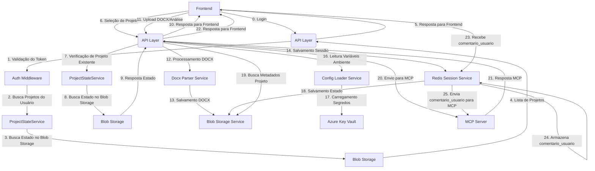

# Resumo Executivo

Este documento detalha o fluxo completo do backend Peers CodeAI, desde o recebimento da requisição do frontend até o envio da resposta, incluindo integrações com Azure Key Vault, Blob Storage, Redis e MCP Server. Cada etapa está explicada, com referência ao arquivo de código responsável e um diagrama ilustrativo em Mermaid.

---

## Diagrama do Fluxo (Mermaid)

---

## Etapa 0: Login e Listagem de Projetos
- **Descrição:** Após o login no frontend, o backend recebe o token, valida via Azure AD e busca todos os projetos do usuário no Blob Storage. A resposta inclui as informações do usuário autenticado e a lista de projetos encontrados.
- **Código responsável:**
  - `backend/app/api/auth.py` (endpoint `POST /auth/login`)
  - `backend/app/middleware/auth_middleware.py` (função `get_current_user`)
  - `backend/app/services/project_state_service.py` (função `list_user_projects`)

---

## Etapas do Fluxo e Código Responsável

### 1. Seleção de Projeto e Verificação de Existência
- **Descrição:** Antes de qualquer operação (upload, análise), o frontend deve chamar o endpoint `/projects/check` para verificar se o projeto existe para o usuário autenticado. Se existir, o backend retorna o último estado salvo do projeto.
- **Código responsável:**
  - `backend/app/api/projects.py` (endpoint `/projects/check`)
  - `backend/app/services/project_state_service.py` (função `load_latest_state_from_blob`)

### 2. Recebimento da Requisição do Frontend
- **Descrição:** O frontend envia requisições para o backend via endpoints HTTP (upload de DOCX, iniciar análise, salvar estado, etc). O campo opcional `comentario_usuario` pode ser enviado junto com o arquivo DOCX ou na solicitação de análise.
- **Código responsável:**
  - `backend/app/api/upload.py` (função `upload_docx`)
  - `backend/app/api/analysis.py` (função `start_analysis`)
  - `backend/app/api/session.py` (funções `get_session_reports`, `update_session_report`, `save_session_state`, `get_session_docx_files`)
  - `backend/app/api/auth.py` (função `get_auth_config`)

### 3. Processamento do DOCX
- **Descrição:** O arquivo DOCX enviado pelo frontend é processado para extrair o texto.
- **Código responsável:**
  - `backend/app/services/docx_parser_service.py` (função `extract_text_from_docx`)
  - Chamado dentro de `upload_docx` em `backend/app/api/upload.py`

### 4. Salvamento do DOCX
- **Descrição:** O arquivo DOCX é salvo no Azure Blob Storage na pasta do usuário/projeto.
- **Código responsável:**
  - `backend/app/services/blob_storage_service.py` (função `upload_docx_to_blob`)
  - Chamado dentro de `upload_docx` em `backend/app/api/upload.py`

### 5. Salvamento dos Dados no Redis
- **Descrição:** Sessões e relatórios são persistidos no Redis para rastreamento do estado. O campo opcional `comentario_usuario` é armazenado na sessão Redis.
- **Código responsável:**
  - `backend/app/services/redis_session_service.py` (funções `create_session`, `update_report`, `add_step`, `restore_session_from_state`, `get_session`, `add_docx_file`)
  - Chamado em endpoints de análise e sessão
  - Campo `comentario_usuario` em `SessionData` (`backend/app/models/session_models.py`)

### 6. Salvamento do caminho do DOCX no estado da sessão
- **Descrição:** Todo arquivo DOCX enviado tem seu caminho salvo no campo `docx_files` do estado da sessão, garantindo histórico completo dos arquivos utilizados para geração e recuperação de todas as histórias.
- **Código responsável:**
  - `backend/app/services/redis_session_service.py` (função `add_docx_file`)
  - `backend/app/models/session_models.py` (campo `docx_files` em `SessionData`)
  - Chamado em `upload_docx` e durante restauração de sessão

### 7. Validação de Tokens
- **Descrição:** O token JWT do Azure AD é validado para autenticação e autorização do usuário.
- **Código responsável:**
  - `backend/app/middleware/auth_middleware.py` (função `get_current_user`)
  - `backend/app/services/azure_ad_service.py` (função `validate_token`)

### 8. Leitura das Variáveis de Ambiente
- **Descrição:** Variáveis de ambiente são lidas para configuração inicial do backend.
- **Código responsável:**
  - `backend/app/core/config.py` (classe `Settings`)
  - `startup.py` (função `validate_env_vars`)
  - `backend/app/services/config_loader_service.py` (classe `ConfigLoaderService`)

### 9. Key Vault
- **Descrição:** Segredos sensíveis são carregados do Azure Key Vault usando Managed Identity.
- **Código responsável:**
  - `backend/app/services/azure_secret_manager.py` (classe `AzureSecretManager`)
  - `backend/app/services/config_loader_service.py` (classe `ConfigLoaderService`, método `load_secrets_from_key_vault`)

### 10. Salvamento do Status no Blob Storage
- **Descrição:** O estado da sessão/projeto é salvo periodicamente no Blob Storage.
- **Código responsável:**
  - `backend/app/services/project_state_service.py` (função `save_state_to_blob`)
  - `backend/app/services/background_state_saver.py` (classe `BackgroundStateSaver`, método `schedule_periodic_save`)

### 11. Verificação de Projeto Existente no Blob Storage
- **Descrição:** Antes de exigir o upload do DOCX, o backend verifica se já existe um estado do projeto para o usuário no Blob Storage. Se existir, o upload não é obrigatório. Se não existir, o upload do DOCX é obrigatório para criar o projeto.
- **Código responsável:**
  - `backend/app/services/project_state_service.py` (função `load_latest_state_from_blob`)
  - Chamado dentro de `start_analysis` em `backend/app/api/analysis.py`

### 12. Busca de Metadados do Projeto no Blob Storage
- **Descrição:** Para projetos existentes, se `analysis_name` e `analysis_type` não forem informados, o backend busca esses metadados automaticamente do estado mais recente do projeto no Blob Storage usando o usuário autenticado.
- **Código responsável:**
  - `backend/app/services/project_state_service.py` (função `get_latest_analysis_metadata`)
  - Chamado dentro de `start_analysis` em `backend/app/api/analysis.py`

### 13. Envio para o MCP Server
- **Descrição:** Payload de análise é enviado para o MCP Server via HTTP. O campo opcional `comentario_usuario` é incluído no payload enviado ao MCP Server.
- **Código responsável:**
  - `backend/app/services/mcp_client_service.py` (função `start_analysis`)
  - Chamado dentro de `start_analysis` em `backend/app/api/analysis.py`

### 14. Recebimento da Resposta do MCP Server
- **Descrição:** A resposta do MCP Server é processada e o job_id é extraído.
- **Código responsável:**
  - `backend/app/services/mcp_client_service.py` (função `start_analysis` - retorno)
  - Chamado dentro de `start_analysis` em `backend/app/api/analysis.py`

### 15. Envio para o Frontend
- **Descrição:** A resposta final (incluindo URLs, job_id, mensagens e dados de sessão) é enviada para o frontend.
- **Código responsável:**
  - `backend/app/api/analysis.py`, `backend/app/api/upload.py`, `backend/app/api/session.py`, `backend/app/api/auth.py` (retorno das funções FastAPI)

### 16. Busca do Estado do Projeto no Blob Storage (Projeto Existente)
- **Descrição:** Quando o usuário seleciona um projeto existente, o estado é recuperado do Blob Storage e restaurado na sessão Redis.
- **Código responsável:**
  - `backend/app/services/project_state_service.py` (função `load_latest_state_from_blob`)
  - Chamado dentro de `start_analysis` em `backend/app/api/analysis.py` quando detectado projeto existente

### 17. Recebimento do comentario_usuario do frontend
- **Descrição:** O campo opcional `comentario_usuario` é recebido do frontend nos endpoints de upload e análise.
- **Código responsável:**
  - `backend/app/api/upload.py` (função `upload_docx`)
  - `backend/app/api/analysis.py` (função `start_analysis`)

### 18. Armazenamento do comentario_usuario na sessão Redis
- **Descrição:** O campo opcional `comentario_usuario` é persistido na sessão Redis para uso posterior.
- **Código responsável:**
  - `backend/app/services/redis_session_service.py` (função `create_session`, campo em SessionData)

### 19. Envio do comentario_usuario para MCP Server
- **Descrição:** O campo opcional `comentario_usuario` é propagado no payload enviado ao MCP Server.
- **Código responsável:**
  - `backend/app/services/mcp_client_service.py` (função `start_analysis`)
  - Chamado dentro de `backend/app/api/analysis.py`

---

## Observações
- O frontend deve sempre chamar `/auth/login` após o login, para validar o token e obter a lista de projetos do usuário.
- O campo opcional `comentario_usuario` pode ser enviado tanto no upload do DOCX quanto na solicitação de análise, e será armazenado na sessão Redis e propagado para o MCP Server.
- Todo arquivo DOCX enviado tem seu caminho salvo no estado da sessão, permitindo rastreabilidade e recuperação de todas as histórias geradas.
- O fluxo garante flexibilidade para o frontend iniciar análises em projetos já existentes sem exigir novo upload ou campos extras, e permite o envio de comentários adicionais pelo usuário.
