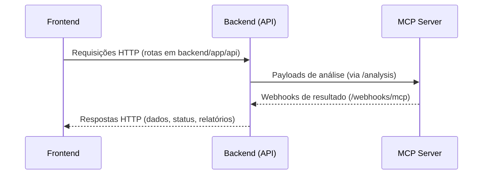
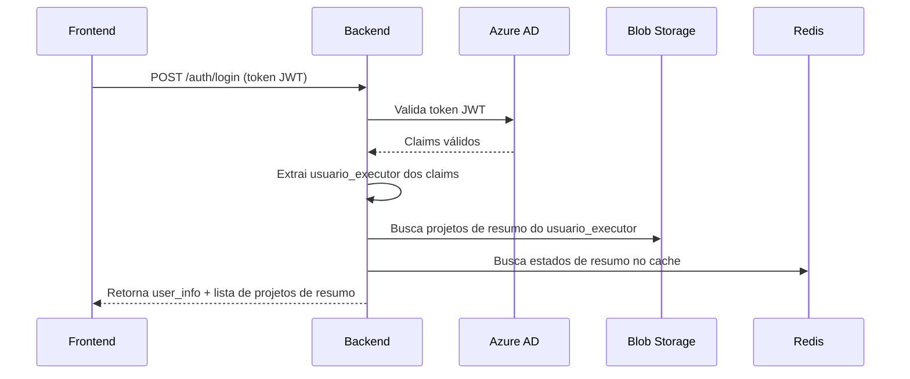
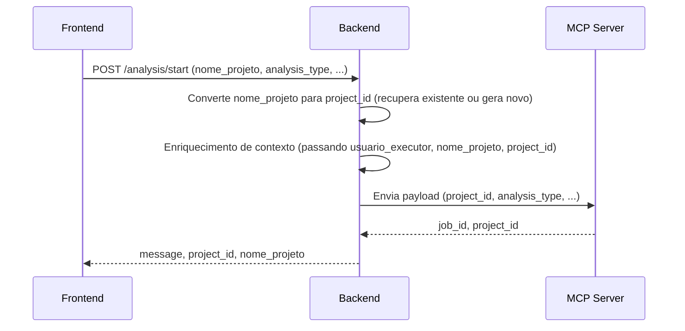
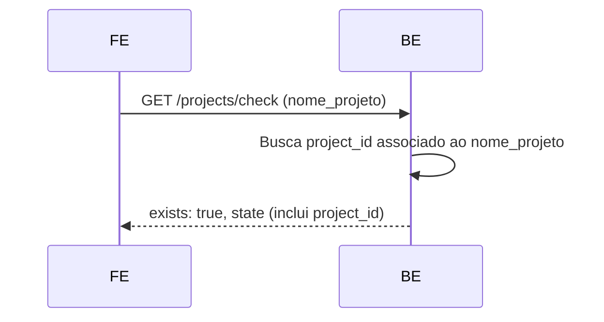
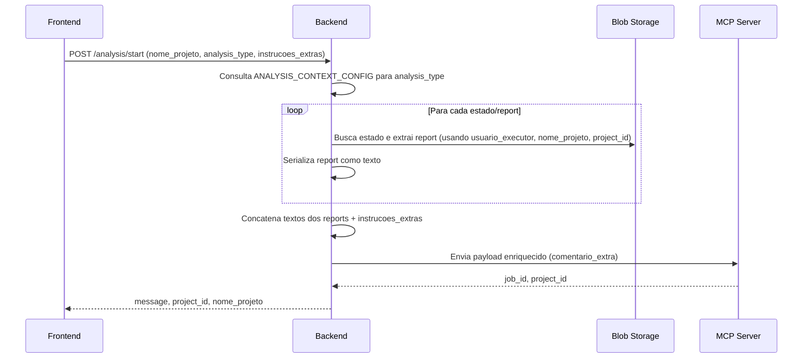
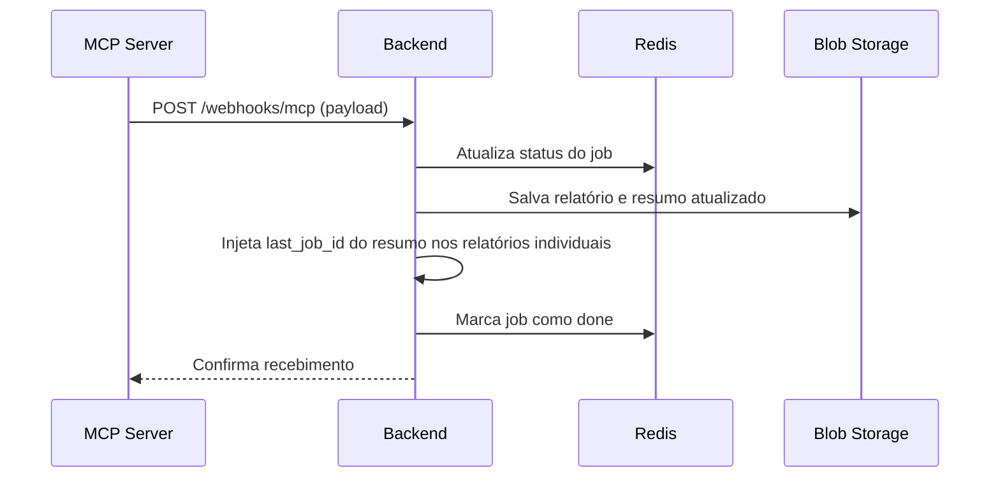

# Arquitetura e Fluxos do Backend Peers CodeAI

Este documento detalha o fluxo completo do backend Peers CodeAI, desde o recebimento da requisição do frontend até o envio da resposta, incluindo integrações com Azure Key Vault (múltiplos cofres), Blob Storage, Redis, MCP Server e o mecanismo de configuração dinâmica de agentes. Cada etapa está explicada, com referência ao arquivo de código responsável e diagramas ilustrativos.

---

## Índice

1. Visão Geral da Comunicação entre Grandes Blocos
2. Login e Autenticação via Azure AD
3. Criação de Projeto e Conversão nome_projeto → project_id
4. Consulta de Projeto Existente
5. Observações Importantes
6. Enriquecimento de Contexto para Refinamento
7. Comunicação via Webhooks (MCP → Backend)
8. Gerenciamento de Sessão e Relatórios
8.1. Lógica de Seleção de Estado Mais Recente
9. Resumo dos Endpoints por Rota
10. Tratamento de Estados Legados e Migração

---

## 1. Visão Geral da Comunicação entre Grandes Blocos

Esta seção apresenta uma visão de alto nível da comunicação entre os principais blocos do sistema: Frontend, Backend (rotas em `backend/app/api`) e MCP Server. O Backend orquestra as requisições recebidas do Frontend, processa dados, integra serviços internos e se comunica com o MCP Server para processamento de inteligência.

**Descrição dos Blocos:**
- **Frontend:** Interface do usuário, responsável por enviar requisições HTTP para o Backend e consumir respostas.
- **Backend (API):** Camada intermediária que expõe rotas REST via FastAPI, localizadas em `backend/app/api`. Cada rota é responsável por uma parte do fluxo, como autenticação, análise, projetos, sessões e webhooks.
- **MCP Server:** Serviço externo de inteligência que recebe payloads do Backend para processamento de análises e retorna resultados via webhooks.

**Diagrama Mermaid:**



---

## 2. Login e Autenticação via Azure AD

Fluxo:
1. O frontend envia o token JWT via header Authorization para o endpoint POST `/auth/login` (implementado em [`backend/app/api/auth.py`]).
2. O backend valida o token via `AzureADService`, usando a chave pública do Azure AD (JWKS).
3. O backend extrai o `usuario_executor` dos claims do token (preferred_username, email ou upn).
4. O backend busca os projetos associados ao `usuario_executor` usando `ProjectStateService._fetch_and_sanitize_projects`.
5. O backend retorna para o frontend a lista de projetos de resumo, contendo apenas os campos: nome_projeto, ultima_analysis_type, created_at, ultima_atualizacao, project_id.

**Nota:** O fluxo de validação do token JWT é orquestrado pela rota `/auth/login` em [`backend/app/api/auth.py`], que utiliza o serviço `AzureADService` para garantir autenticidade e extração segura do usuário.



---

## 3. Criação de Projeto e Conversão nome_projeto → project_id

O frontend deve sempre enviar apenas o campo `nome_projeto` para criação ou início de análise. O backend é responsável por converter internamente o `nome_projeto` para `project_id`:
- Se o projeto já existe, o backend recupera o mesmo `project_id` do estado salvo.
- Se o projeto é novo, o backend gera um novo `project_id` (UUID) e associa ao nome do projeto.
- O `project_id` é retornado na resposta do backend para uso em operações subsequentes.
- O enriquecimento de contexto agora exige usuario_executor e nome_projeto como parâmetros obrigatórios.
- **Nota de validação:** O backend utiliza o método `validate_and_fix_project_id` para garantir que todo estado recuperado possua um `project_id` válido, corrigindo automaticamente estados legados ou incompletos. Logs de warning são gerados quando correções são aplicadas.

**Nota:** Este fluxo é implementado pela rota `/analysis/start` em [`backend/app/api/analysis.py`], que utiliza o serviço `ProjectStateService` para conversão e persistência do identificador do projeto.



---

## 4. Consulta de Projeto Existente

O Backend permite ao frontend consultar a existência de um projeto pelo nome, retornando o estado associado se encontrado.

**Nota:** Este fluxo é implementado pela rota `/projects/check` em [`backend/app/api/projects.py`], que utiliza o serviço `ProjectStateService` para buscar e validar projetos existentes.



---

## 5. Observações Importantes

- O campo `project_id` nunca deve ser enviado pelo frontend. O backend faz toda a conversão e retorna o `project_id` correto.
- Toda comunicação interna e com MCP utiliza o `project_id` gerado ou recuperado pelo backend.
- O frontend deve usar o `project_id` retornado para todas operações subsequentes (consultas, atualizações, etc).

---

## 6. Enriquecimento de Contexto para Refinamento

Quando o frontend envia um `analysis_type` de refinamento (ex: `refinamento_epicos_azure_devops`), o backend executa um processo de enriquecimento de contexto antes de enviar o payload ao MCP:

1. O backend consulta uma configuração (`ANALYSIS_CONTEXT_CONFIG`) que mapeia o `analysis_type` para uma lista de estados/reports a serem lidos do Blob Storage.
2. Para cada entrada, o backend recupera o estado correspondente usando `ProjectStateService.load_latest_state_from_blob()` e extrai o campo de report relevante (ex: `epicos_report`).
3. O conteúdo do report é serializado em string (usando JSON ou formatação legível).
4. Todos os textos extraídos são concatenados junto com o texto original de `instrucoes_extras` enviado pelo frontend.
5. O texto enriquecido é enviado no campo `comentario_extra` do payload para o MCP.
6. O método de enriquecimento agora exige usuario_executor e nome_projeto como argumentos obrigatórios e repassa corretamente para o serviço de estado.

**Nota:** Este fluxo é orquestrado pela rota `/analysis/start` em [`backend/app/api/analysis.py`] e pelo serviço `ContextEnrichmentService`, garantindo que o contexto enviado ao MCP seja o mais completo possível.



---

## 7. Comunicação via Webhooks (MCP → Backend)

Esta seção detalha o fluxo de recebimento de webhooks do MCP pela rota `backend/app/api/webhooks.py`. Quando o MCP finaliza um processamento, ele envia um webhook para o backend, que atualiza o estado do projeto no Redis e Blob Storage.

Fluxo:
1. MCP envia webhook para `/webhooks/mcp` com payload contendo `project_id`, `job_id`, `status` e `report_data`.
2. O backend valida o payload e atualiza o status do job no Redis.
3. Se o status for "done", o backend atualiza os relatórios e salva o estado atualizado no Blob Storage.
4. O backend atualiza o resumo do projeto, garantindo que o campo `ultima_analysis_type` seja consistente.
5. O campo `last_job_id` do resumo é considerado a fonte de verdade para o job_id atual do projeto. Este valor é propagado para os relatórios individuais, sobrescrevendo qualquer job_id divergente que possa existir nos estados de relatório.
6. O job é marcado como finalizado no Redis.

**Nota explicativa:**
- O campo `last_job_id` do resumo é priorizado sobre os job_ids dos relatórios individuais. Isso garante consistência e evita divergências entre estados legados ou relatórios processados fora de ordem. Toda consulta e atualização de relatórios utiliza o job_id mestre do resumo como referência principal.
- Ao receber um webhook de sucesso, o backend injeta o `last_job_id` do resumo nos relatórios individuais, tornando o resumo a autoridade máxima para o job_id do projeto.

**Diagrama Mermaid atualizado:**



---

## 8. Gerenciamento de Sessão e Relatórios

A rota `backend/app/api/session.py` é responsável pela consulta e atualização de relatórios dos projetos, além do gerenciamento da sessão do usuário.

Fluxo:
1. O frontend consulta relatórios específicos usando endpoints como `/session/project/{project_id}/{job_id}/reports`.
2. O backend busca o estado do projeto no Blob Storage e Redis, validando o job_id e retornando o relatório correspondente.
3. Para atualização de relatórios, o frontend envia dados via PUT para `/session/project/{project_id}/report`, e o backend atualiza o Redis e salva o novo estado no Blob Storage.
4. O backend também permite consultar arquivos docx associados ao projeto e salvar o estado manualmente.

**Lógica de ordenação por timestamp (prioridade):**
- Ao buscar o estado mais recente de um projeto, o backend utiliza o seguinte critério de ordenação:
    1. **Timestamp presente no nome do arquivo do blob** (formato `estado_<tipo>_YYYYMMDDTHHMMSSZ.json`), considerado a fonte mais confiável de criação.
    2. Se o nome não seguir o padrão, utiliza o campo `created_at` do JSON interno do estado.
    3. Se ambos estiverem ausentes ou inválidos, utiliza o campo `ultima_atualizacao` do JSON.
    4. Se todos falharem, considera a data mínima para ir ao fim da fila.
- Apenas o arquivo mais recente, segundo essa ordenação, é considerado para operações de leitura e atualização.

---

## 8.1. Lógica de Seleção de Estado Mais Recente

Esta subseção detalha o algoritmo utilizado para selecionar o estado mais recente de um projeto, conforme implementado em `backend/app/services/project_state_service.py` (método `load_latest_state_from_blob`).

**Fluxo resumido:**
1. Filtra blobs pelo prefixo e tipo de relatório desejado.
2. Para cada blob candidato:
    - Extrai o timestamp do nome do arquivo, se possível.
    - Caso não seja possível, tenta usar o campo `created_at` do JSON.
    - Caso ainda não seja possível, tenta o campo `ultima_atualizacao`.
    - Se todos falharem, utiliza data mínima.
3. Ordena todos os candidatos do mais novo para o mais antigo.
4. Seleciona o primeiro da lista como estado mais recente.

**Exemplo de código Mermaid ilustrando o fluxo de decisão:**

```mermaid
flowchart TD
    A[Início: Lista de blobs candidatos] --> B{Para cada blob}
    B --> C1[Extrai timestamp do nome do arquivo]
    C1 --> D1{Timestamp válido?}
    D1 -- Sim --> E1[Usa timestamp do nome]
    D1 -- Não --> C2[Tenta campo created_at do JSON]
    C2 --> D2{created_at válido?}
    D2 -- Sim --> E2[Usa created_at]
    D2 -- Não --> C3[Tenta campo ultima_atualizacao do JSON]
    C3 --> D3{ultima_atualizacao válido?}
    D3 -- Sim --> E3[Usa ultima_atualizacao]
    D3 -- Não --> E4[Usa data mínima]
    E1 & E2 & E3 & E4 --> F[Ordena blobs por data (desc)]
    F --> G[Seleciona blob mais recente]
```

---

## 9. Resumo dos Endpoints por Rota

| Arquivo                      | Endpoint(s)                                 | Descrição                                                                 |
|-----------------------------|---------------------------------------------|---------------------------------------------------------------------------|
| `auth.py`                   | `/auth/login`, `/auth/config`               | Autenticação e configuração Azure AD                                      |
| `analysis.py`               | `/analysis/start`                           | Início de análise, conversão nome_projeto → project_id, enriquecimento de contexto |
| `projects.py`               | `/projects/check`, `/projects/list`         | Consulta e listagem de projetos existentes                                |
| `session.py`                | `/session/project/{project_id}/{job_id}/reports`, `/session/project/{project_id}/report`, `/session/project/{project_id}/save-state`, `/session/project/{project_id}/docx-files` | Consulta, atualização e gerenciamento de relatórios e arquivos de sessão. Inclui validação de job_id mestre (last_job_id do resumo) nos endpoints de consulta de relatórios. |
| `webhooks.py`               | `/webhooks/mcp`                             | Recebimento de webhooks do MCP, atualização de estado e relatórios. Prioriza o last_job_id do resumo como referência para todos relatórios. |

---

## 10. Tratamento de Estados Legados e Migração

Esta seção documenta o comportamento do sistema ao encontrar estados legados, especialmente arquivos de resumo ou relatório que estejam sem `job_id` ou `project_id`.

- Ao ler estados do Blob Storage, o backend utiliza o método `validate_and_fix_project_id` para corrigir automaticamente estados que estejam sem `project_id`, gerando um novo UUID quando necessário e logando um warning.
- Quando um relatório ou resumo está sem `job_id`, o backend injeta o valor do `last_job_id` do resumo como referência principal, garantindo consistência entre todos os relatórios do projeto.
- Logs de warning são emitidos sempre que um estado legado é corrigido automaticamente, permitindo rastreabilidade e facilitando a migração futura para o novo padrão.
- Estratégia de fallback: estados sem os campos obrigatórios são ignorados nas operações críticas, e o sistema tenta recuperar informações válidas de outros blobs ou gera identificadores novos conforme necessário.
- A lógica de correção automática é implementada nos métodos de leitura e sanitização de estados em `backend/app/services/project_state_service.py` e `backend/app/services/redis_session_service.py`.
