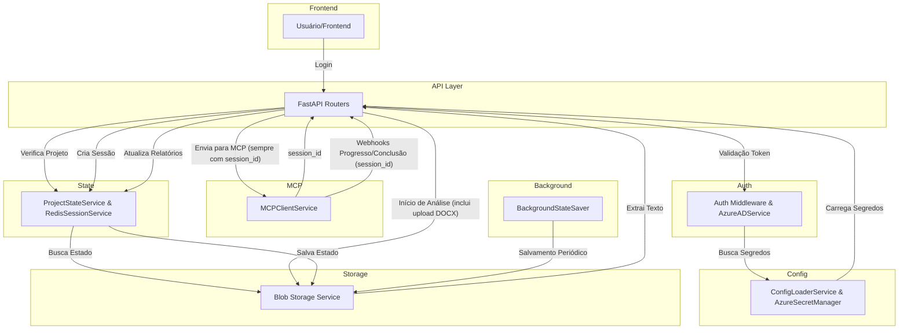

# Arquitetura e Fluxos do Backend Peers CodeAI

Este documento detalha o fluxo completo do backend Peers CodeAI, desde o recebimento da requisição do frontend até o envio da resposta, incluindo integrações com Azure Key Vault (múltiplos cofres), Blob Storage, Redis, MCP Server e o mecanismo de configuração dinâmica de agentes. Cada etapa está explicada, com referência ao arquivo de código responsável e diagramas ilustrativos.

---

## Diagrama Geral do Fluxo (Mermaid)

---

## Etapas do Fluxo e Código Responsável

### 1. Login e Autenticação via Azure AD
- O frontend envia o token JWT via header `Authorization`. O backend valida o token, extrai o `usuario_executor` e retorna a lista de projetos do usuário.
- O backend gera um novo `session_id` apenas se não houver nenhum projeto existente para o usuário. Caso contrário, o `session_id` retornado é sempre o mesmo do estado mais recente do projeto selecionado (extraído do Redis ou Blob Storage, nunca gerado novamente para projetos existentes).
- O `session_id` é o único identificador propagado em todas as interações da sessão.
- Código:
  - `backend/app/api/auth.py` (`POST /auth/login`)
  - `backend/app/middleware/auth_middleware.py` (`get_current_user`)
  - `backend/app/services/azure_ad_service.py` (`validate_token`)
  - `backend/app/services/project_state_service.py` (`list_user_projects`, `get_session_id_from_latest_state`)

### 2. Verificação de Projeto Existente
- O frontend chama `/projects/check` para saber se o projeto existe. O backend busca o estado mais recente do projeto **primeiro no Redis** (sessão ativa), e só faz fallback para o Blob Storage se não encontrar no Redis.
- O estado retornado sempre inclui o `session_id` da sessão mais recente (do Redis ou Blob).
- Se a sessão não estiver no Redis, o backend restaura a sessão usando o `session_id` do Blob antes de retornar o estado.
- Código:
  - `backend/app/api/projects.py` (`/projects/check`)
  - `backend/app/services/redis_session_service.py` (`get_session_by_project`, `restore_session_from_state`)
  - `backend/app/services/project_state_service.py` (`load_latest_state_from_redis`, `load_latest_state_from_blob`, `get_session_id_from_latest_state`)

#### Diagrama de Sequência: Consulta de Estado de Projeto

mermaid
sequenceDiagram
    participant FE as Frontend
    participant BE as Backend
    participant RS as RedisSessionService
    participant PS as ProjectStateService
    participant BS as Blob Storage
    FE->>BE: GET /projects/check?projeto=NomeProjeto
    BE->>RS: get_session_by_project(usuario_executor, projeto)
    alt Sessão encontrada no Redis
        RS-->>BE: SessionData
        BE->>PS: load_latest_state_from_redis(session_id)
        PS-->>BE: Estado mais recente (do Redis)
        BE-->>FE: exists: true, state (do Redis)
    else Sessão não encontrada no Redis
        BE->>PS: load_latest_state_from_blob(usuario_executor, projeto)
        PS-->>BE: Estado (do Blob Storage)
        BE->>RS: restore_session_from_state(usuario_executor, projeto, analysis_type, state, session_id)
        RS-->>BE: session_id
        BE-->>FE: exists: true, state (do Blob Storage)
    end
    Note over BE: O campo 'reports' sempre reflete o estado mais recente disponível

### 3. Início de Análise e Upload de DOCX (Processamento Paralelo)
- O upload do arquivo DOCX e a extração do texto ocorrem dentro do endpoint `/analysis/start` via multipart/form-data. O backend retorna tanto a URL do arquivo quanto o texto extraído.
- O backend sempre envia o `session_id` para o MCP e espera que o MCP retorne o mesmo `session_id` em todas as respostas e webhooks.
- Para projetos existentes, o `session_id` é sempre reutilizado do estado mais recente.
- Código:
  - `backend/app/api/analysis.py` (`/analysis/start`)
  - `backend/app/services/blob_storage_service.py` (`upload_and_extract_docx`)
  - `backend/app/services/docx_parser_service.py` (`extract_text_from_docx`)

### 4. Criação e Gerenciamento de Sessão no Redis
- Sessões são criadas e persistidas no Redis, incluindo campos como `comentario_usuario`, `extracted_text`, `project_id`, `docx_files` e `reports`.
- O único identificador de sessão é o `session_id`, gerado no login (apenas para projetos novos) ou sempre reutilizado para projetos existentes.
- Na restauração de sessão a partir do estado do Blob, o `session_id` passado sempre deve ser igual ao do estado carregado. Se forem diferentes, um aviso é logado e o `session_id` do estado é utilizado.
- Código:
  - `backend/app/services/redis_session_service.py` (`create_session`, `add_docx_file`, `update_session_extracted_text`, `update_report`, `restore_session_from_state`, `get_session_by_project`)
  - `backend/app/models/session_models.py` (`SessionData`)

### 5. Salvamento Automático e Periódico de Estado no Blob Storage
- Estados de sessão/projeto são salvos periodicamente no Blob Storage via `BackgroundStateSaver`. Mudanças em relatórios ou estado acionam o salvamento automático.
- Cada novo estado é salvo como um novo arquivo, nunca sobrescrevendo o anterior. O nome do arquivo sempre inclui o `session_id` e um timestamp.
- Código:
  - `backend/app/services/background_state_saver.py` (`schedule_periodic_save`)
  - `backend/app/services/project_state_service.py` (`save_state_to_blob`)
  - `backend/app/services/redis_session_service.py` (`update_session_on_state_change`)

### 6. Carregamento de Segredos do Key Vault (Múltiplos Cofres)
- Segredos sensíveis são carregados de múltiplos Key Vaults (Azure, DevOps, GitHub, LLM) via Managed Identity. Existe fallback para variáveis de ambiente.
- Código:
  - `backend/app/services/config_loader_service.py` (`load_secrets_from_key_vault`)
  - `backend/app/services/azure_secret_manager.py` (`AzureSecretManager`)
  - `backend/app/core/config.py` (`Settings`)

### 7. Configuração Dinâmica de Agentes MCP
- Arquivo: `backend/config/mcp_agents.json` define agentes MCP, URLs, campos de relatório e mapeamentos.
- Carregamento: `MCPConfigService.load_config` carrega o JSON na inicialização.
- Roteamento: `MCPClientService.get_mcp_endpoint` seleciona a URL do MCP conforme `analysis_type`.
- Mapeamento de Relatórios: `RedisSessionService.update_report` usa `report_mapping` para salvar relatórios no campo correto.
- Extensibilidade: Novos agentes podem ser adicionados apenas editando o JSON.

**Exemplo de configuração de agente:**

{
  "agents": {
    "criacao_epicos_azure_devops": {
      "agent_name": "Epicos Azure DevOps",
      "mcp_url": "https://mcp-epicos.azurewebsites.net",
      "report_fields": ["epicos_report"],
      "report_mapping": {"epicos": "epicos_report"}
    },
    "features_generation": {
      "agent_name": "Features Generator",
      "mcp_url": "https://mcp-features.azurewebsites.net",
      "report_fields": ["features_report"],
      "report_mapping": {"features": "features_report"}
    }
  }
}

---

## 8. Webhook MCP: Recuperação Automática de Sessão e Atualização de Relatório

A partir da versão X.X.X, o backend garante que **toda vez que um webhook do MCP é recebido, o relatório é atualizado corretamente**, mesmo que a sessão não esteja mais presente no Redis (por exemplo, após expiração, reinício ou falha do Redis). O fluxo é o seguinte:

### Diagrama de Sequência: Webhook MCP → Recuperação de Sessão → Atualização de Relatório

mermaid
sequenceDiagram
    participant MCP as MCP Server
    participant BE as Backend
    participant RS as RedisSessionService
    participant PS as ProjectStateService
    participant BS as Blob Storage
    MCP->>BE: POST /webhooks/mcp (session_id, status, report_type, ...)
    BE->>RS: get_session(session_id)
    alt Sessão encontrada no Redis
        RS-->>BE: SessionData
        BE->>RS: update_report(session_id, ...)
        RS-->>BE: OK
    else Sessão NÃO encontrada no Redis
        BE->>PS: load_latest_state_from_blob(usuario_executor, projeto, session_id)
        alt Encontrou estado no Blob
            PS-->>BE: project_state
            BE->>RS: restore_session_from_state(usuario_executor, projeto, analysis_type, project_state, session_id)
            RS-->>BE: session_id
            BE->>RS: update_report(session_id, ...)
            RS-->>BE: OK
        else Não encontrou estado no Blob
            BE->>PS: load_latest_state_by_session_id(session_id)
            alt Encontrou estado pelo session_id
                PS-->>BE: project_state
                BE->>RS: restore_session_from_state(usuario_executor, projeto, analysis_type, project_state, session_id)
                RS-->>BE: session_id
                BE->>RS: update_report(session_id, ...)
                RS-->>BE: OK
            else Não encontrou estado em lugar nenhum
                BE-->>MCP: 404 Sessão não encontrada
            end
        end
    end
    Note over BE: O relatório é sempre atualizado, não importa se a sessão foi criada em outra sessão ou restaurada do Blob

### Código Responsável
- `backend/app/api/webhooks.py` (endpoint `/webhooks/mcp`):
  - Tenta buscar a sessão no Redis. Se não encontrar, busca no Blob Storage usando `usuario_executor` e `projeto` (se disponíveis) ou apenas `session_id`.
  - Se encontrar o estado, restaura a sessão no Redis e executa a atualização do relatório.
  - Se não encontrar em nenhum lugar, retorna 404.
  - Logs detalhados em cada etapa.
- `backend/app/services/redis_session_service.py`:
  - Função `_ensure_session_exists` implementa toda a lógica de busca e restauração automática.
  - Função `update_report` sempre chama `_ensure_session_exists` antes de atualizar o relatório.
  - Função `restore_session_from_state` garante que o session_id passado seja igual ao do estado carregado, logando um aviso se forem diferentes.
- `backend/app/services/project_state_service.py`:
  - Função `load_latest_state_by_session_id` permite buscar o estado no Blob Storage apenas pelo `session_id`.

### Garantias do Novo Fluxo
- O relatório é atualizado sempre que um webhook do MCP é recebido, independentemente do estado do Redis.
- O frontend pode confiar que, ao consultar `/projects/check`, o estado refletirá o relatório mais recente, mesmo após falhas temporárias do Redis.
- Logs detalhados permitem rastrear todo o fluxo de recuperação e atualização.

---

## Observações

- O campo `analysis_name` foi removido de todos os fluxos e payloads.
- Para iniciar análise, é obrigatório informar `analysis_type` e pelo menos um de `file` (arquivo DOCX) ou `comentario_usuario`.
- O upload de DOCX ocorre dentro do endpoint `/analysis/start` via multipart/form-data.
- O salvamento de estado no Blob Storage é automático e periódico, disparado por alterações de relatório ou estado.
- O cache de segredos do Key Vault é thread-safe e evita múltiplas chamadas desnecessárias.
- O Redis **deve** ser configurado via Key Vault (não via variáveis de ambiente do App Service).
- Para ambientes com Redis em subrede privada, o App Service deve estar integrado à mesma VNET.
- O sistema pode operar em modo de teste com autenticação mockada (`SKIP_AUTH_FOR_TESTING`), útil para desenvolvimento local.
- Todos os exemplos de payload e resposta estão detalhados em `backend/docs/API_PAYLOAD_EXAMPLES.md`.
- O único identificador usado em toda a comunicação é o `session_id`, gerado no login e persistido em todas as etapas do fluxo.
- O MCP nunca gera nenhum identificador próprio: sempre recebe e retorna o `session_id` enviado pelo backend.
- Quando for buscar o estado mais atual de uma sessão, deve-se usar o `session_id` e pegar o estado mais recente (por timestamp, se houver múltiplos arquivos no Blob).
- O backend nunca atualiza um registro de sessão já salvo: sempre cria um novo estado com os dados atualizados da sessão.
- Após cada atualização de relatório via webhook do MCP, o estado é salvo imediatamente no Blob Storage e o Redis é atualizado, garantindo consistência e minimizando perda de dados em caso de falha.
- O endpoint `/projects/check` sempre retorna o estado mais recente disponível, priorizando o Redis.
