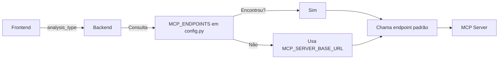

# Configuração de Endpoints MCP Dinâmicos

Este documento explica como configurar e utilizar o mapeamento dinâmico de `analysis_type` para diferentes endpoints do MCP Server. O objetivo é garantir que, ao receber uma requisição de análise, o backend envie o payload para o endpoint correto do MCP, conforme o tipo de análise solicitado pelo frontend.

## 1. Visão Geral

O backend suporta múltiplos tipos de análise, cada um podendo ser processado por um serviço MCP diferente. O roteamento para o endpoint correto é feito dinamicamente, com base no campo `analysis_type` enviado pelo frontend.

- O mapeamento é definido no dicionário `MCP_ENDPOINTS` no arquivo `config.py`.
- O serviço `MCPClientService` resolve o endpoint correto usando o método `get_mcp_endpoint()`.
- Se não houver mapeamento específico para o `analysis_type`, o backend utiliza o endpoint padrão (`MCP_SERVER_BASE_URL`).

## 2. Exemplo de Configuração no .env

Você pode definir os endpoints MCP diretamente nas variáveis de ambiente, que serão carregadas pelo Pydantic Settings.

Exemplo de variáveis no `.env`:
```text
env
MCP_SERVER_BASE_URL=http://mcp-app-service.azurewebsites.net
MCP_ENDPOINTS__criacao_epicos_azure_devops=https://mcp-epicos.azurewebsites.net
MCP_ENDPOINTS__analise_reuniao=https://mcp-reuniao.azurewebsites.net
```

> **Nota:** O padrão do Pydantic Settings permite mapear dicionários usando prefixos separados por `__` (dois underlines).

## 3. Estrutura do Dicionário MCP_ENDPOINTS em config.py

No arquivo `backend/app/core/config.py`:
```text
python
class Settings(BaseSettings):
    # ... outras configs ...
    MCP_SERVER_BASE_URL: str = "http://mcp-app-service.azurewebsites.net"
    MCP_ENDPOINTS: Dict[str, str] = {
        "criacao_epicos_azure_devops": "https://mcp-epicos.azurewebsites.net"
        # Adicione outros mapeamentos conforme necessário
    }
    class Config:
        env_file = ".env"
        env_file_encoding = "utf-8"
```

Ao carregar o backend, o Pydantic irá popular o dicionário `MCP_ENDPOINTS` com base nas variáveis de ambiente que seguem o padrão `MCP_ENDPOINTS__<analysis_type>=<url>`.

## 4. Como o MCPClientService Resolve o Endpoint

O serviço responsável por enviar o payload ao MCP Server é o `MCPClientService`, localizado em `backend/app/services/mcp_client_service.py`.

Trecho relevante:
```text
python
class MCPClientService:
    def __init__(self, base_url: str = None):
        self.base_url = base_url or settings.MCP_SERVER_BASE_URL.rstrip('/')

    def get_mcp_endpoint(self, analysis_type: str) -> str:
        endpoint_dict = getattr(settings, 'MCP_ENDPOINTS', {})
        return endpoint_dict.get(analysis_type, self.base_url)

    async def start_analysis(self, payload: MCPStartAnalysisPayload) -> MCPStartAnalysisResponse:
        url = f"{self.get_mcp_endpoint(payload.analysis_type)}/start-analysis"
        # ... chamada HTTPX ...
```

Ou seja, o endpoint é resolvido assim:
- Se existir um mapeamento para o `analysis_type` em `MCP_ENDPOINTS`, ele será usado.
- Caso contrário, será usado o valor padrão de `MCP_SERVER_BASE_URL`.

## 5. Exemplo de Payload e Fluxo de Decisão

### Payload enviado pelo backend para o MCP:

```json
{
  "analysis_type": "criacao_epicos_azure_devops",
  "instrucoes_extras": "Texto extraído do docx...",
  "projeto": "ProjetoX",
  "analysis_name": "Reuniao_01",
  "usuario_executor": "user@example.com"
}
```

### Fluxo de Decisão (Diagrama Mermaid)



## 6. Exemplo Prático

1. O frontend envia um arquivo para `/upload/docx` com `analysis_type="criacao_epicos_azure_devops"`.
2. O backend consulta `MCP_ENDPOINTS` e encontra o endpoint `https://mcp-epicos.azurewebsites.net`.
3. O payload é enviado para `https://mcp-epicos.azurewebsites.net/start-analysis`.
4. Se o `analysis_type` não estivesse mapeado, o backend usaria `MCP_SERVER_BASE_URL`.

## 7. Como Adicionar Novos Endpoints

- Adicione uma linha ao seu `.env` seguindo o padrão:
  env
  MCP_ENDPOINTS__<analysis_type>=<url_do_endpoint>
  
  Exemplo:
  env
  MCP_ENDPOINTS__analise_reuniao=https://mcp-reuniao.azurewebsites.net
  
- Reinicie o backend para que as configurações sejam recarregadas.

## 8. Referências de Código
- `backend/app/core/config.py` — Definição do dicionário MCP_ENDPOINTS
- `backend/app/services/mcp_client_service.py` — Lógica de resolução e chamada do endpoint

---

> Para dúvidas ou problemas, consulte este documento ou entre em contato com o time de backend.
