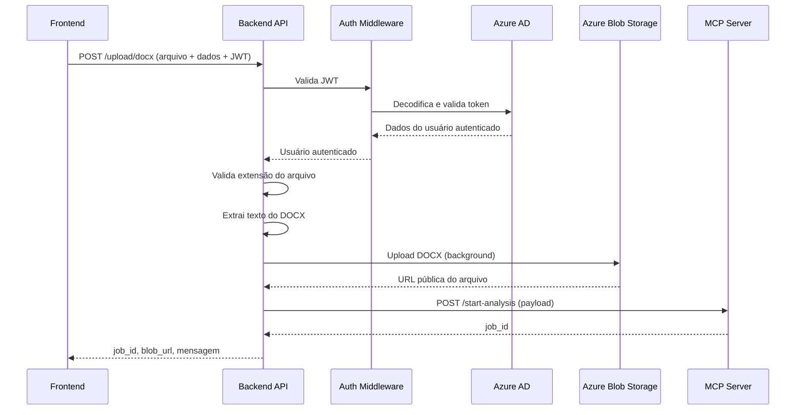

# Visão Geral do Backend - Upload DOCX, Autenticação e Integração MCP

Este documento apresenta de forma objetiva o funcionamento essencial do backend, detalhando o fluxo principal desde o recebimento da requisição do frontend até a geração e retorno do relatório via MCP Server. O foco é mostrar os pontos críticos para operação da solução, com referências diretas ao código responsável em cada etapa.

## 1. Propósito do Backend

O backend implementa:
- Autenticação de usuários via Azure AD/JWT
- Upload seguro de arquivos DOCX
- Extração de texto dos arquivos DOCX
- Armazenamento dos arquivos no Azure Blob Storage
- Comunicação com MCP Server para iniciar análise e gerar relatório

## 2. Fluxo Completo da Requisição

Abaixo, o fluxo principal desde o frontend até o retorno da resposta, com os componentes envolvidos:



## 3. Etapas Críticas e Código Responsável

### a) Recebimento da Requisição e Autenticação
- **Endpoint:** `POST /upload/docx`
- **Arquivo:** [`backend/app/api/upload.py`](../app/api/upload.py)
- **Código:**
  python
  @router.post("/upload/docx", ...)
  async def upload_docx(..., current_user: dict = Depends(get_current_user)):
      # ...
  
- **Autenticação:**
  - Middleware intercepta o header `Authorization: Bearer <JWT>`
  - **Arquivo:** [`backend/app/middleware/auth_middleware.py`](../app/middleware/auth_middleware.py)
  - **Código:**
    python
    def get_current_user(request: Request) -> AzureADTokenData:
        auth: str = request.headers.get("Authorization")
        scheme, param = get_authorization_scheme_param(auth)
        if not auth or scheme.lower() != "bearer":
            raise HTTPException(...)
        return azure_ad_service.validate_token(param)
    
  - **Validação do token:**
    - **Arquivo:** [`backend/app/services/azure_ad_service.py`](../app/services/azure_ad_service.py)
    - **Código:**
      python
      def validate_token(self, token: str) -> AzureADTokenData:
          # Decodifica JWT, verifica expiração, extrai usuario_executor
      

### b) Validação do Arquivo
- **Arquivo:** [`backend/app/api/upload.py`](../app/api/upload.py)
- **Código:**
  python
  if not file.filename.lower().endswith(".docx"):
      raise HTTPException(status_code=400, detail="Apenas arquivos .docx são permitidos.")
  

### c) Extração de Texto do DOCX
- **Arquivo:** [`backend/app/services/docx_parser_service.py`](../app/services/docx_parser_service.py)
- **Código:**
  python
  texto_extraido = await extract_text_from_docx(file)
  # Função:
  async def extract_text_from_docx(file: UploadFile) -> str:
      # Lê o arquivo e extrai texto dos parágrafos
  

### d) Upload para Azure Blob Storage
- **Arquivo:** [`backend/app/services/blob_storage_service.py`](../app/services/blob_storage_service.py)
- **Código:**
  python
  blob_url = await upload_docx_to_blob(file, blob_folder, blob_filename, background_tasks)
  # Função:
  async def upload_docx_to_blob(file: UploadFile, blob_folder: str, blob_filename: str, background_tasks: BackgroundTasks) -> str:
      # Adiciona tarefa de upload em background e retorna URL
  

### e) Montagem do Payload e Comunicação com MCP Server
- **Arquivo:** [`backend/app/services/mcp_client_service.py`](../app/services/mcp_client_service.py)
- **Código:**
  python
  payload = MCPStartAnalysisPayload(...)
  mcp_client = MCPClientService()
  mcp_response = await mcp_client.start_analysis(payload)
  # Função:
  async def start_analysis(self, payload: MCPStartAnalysisPayload) -> MCPStartAnalysisResponse:
      # Envia POST para MCP Server e retorna job_id
  

### f) Resposta ao Frontend
- **Arquivo:** [`backend/app/api/upload.py`](../app/api/upload.py)
- **Código:**
  python
  return UploadDocxResponse(job_id=job_id, blob_url=blob_url, message="Arquivo recebido, salvo e análise iniciada com sucesso.")
  

## 4. Exemplos de Payloads

### a) Requisição (Frontend → Backend)
http
POST /upload/docx
Authorization: Bearer <JWT_TOKEN>
Content-Type: multipart/form-data

file: <arquivo.docx>
projeto: "ProjetoX"
analysis_name: "Reuniao_01"
analysis_type: "criacao_epicos_azure_devops"


### b) Payload enviado para MCP Server
```json
{
  "analysis_type": "criacao_epicos_azure_devops",
  "instrucoes_extras": "Texto extraído do docx...",
  "projeto": "ProjetoX",
  "analysis_name": "Reuniao_01",
  "usuario_executor": "user@example.com"
}
```

### c) Resposta (Backend → Frontend)
```json
{
  "job_id": "abc-123",
  "blob_url": "https://blobstorage.azure.com/user/projetoX/arquivos_recebidos/docx/Reuniao_01.docx",
  "message": "Arquivo recebido, salvo e análise iniciada com sucesso."
}
```
## 5. Resumo

O endpoint `/upload/docx` implementa um fluxo seguro e eficiente para receber arquivos DOCX do frontend, validar o usuário e o arquivo, extrair o texto, armazenar o arquivo no Azure Blob Storage e acionar o MCP Server para análise. Todo o processo é protegido por autenticação JWT e possui tratamento robusto de erros para garantir confiabilidade na comunicação entre os componentes. Cada etapa é claramente mapeada para funções e arquivos do código, facilitando manutenção e auditoria.
