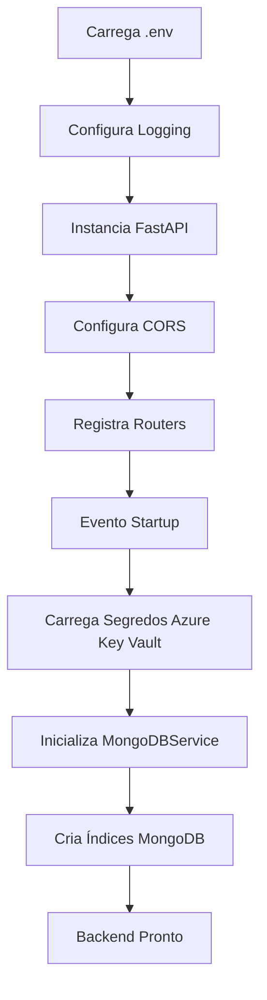
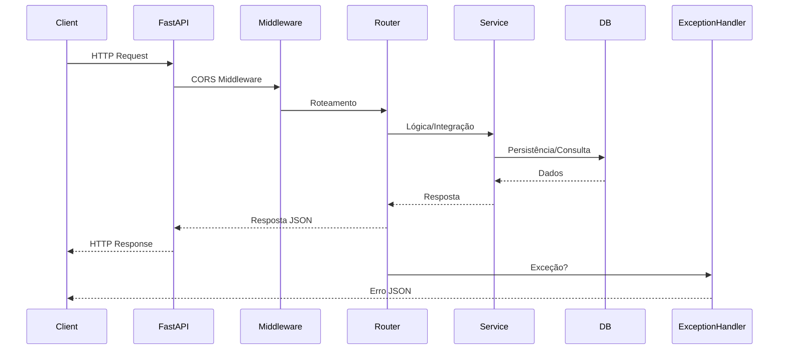

# Arquitetura do Backend - Peers CodeAI

## Visão Geral

O backend do Peers CodeAI é construído sobre FastAPI, com foco em modularidade, escalabilidade e integração com serviços externos (Azure, MongoDB, Redis). O arquivo `main.py` é o ponto de entrada, responsável pela configuração global, registro de routers e inicialização de serviços críticos.

## Principais Funcionalidades

- **Configuração de Logging Estruturado:** Logs em JSON, com campos base, extras e tratamento de exceções.
- **Carregamento de Segredos (Azure Key Vault):** Segredos de configuração são carregados no startup.
- **Inicialização do FastAPI:** Configuração de CORS, registro de routers.
- **Gerenciamento de Sessões (Redis):** Sessões de usuário são gerenciadas via Redis.
- **Conexão com MongoDB:** Serviço MongoDB inicializado e índices criados no startup.
- **Handlers de Exceção:** Tratamento centralizado para HTTPException e exceções genéricas.

## Módulos

- **API:** Endpoints organizados por domínio (`auth`, `analysis`, `session`, `webhooks`, `user_projects`, `project_management`, `project_actions`, `groups`, `user_agents`).
- **Services:** Lógica de negócio e integração com recursos externos (`mongodb_service`, `config_loader_service`, `azure_secret_manager`, etc).
- **Models:** Definições de dados e validação (Pydantic).
- **Utils:** Utilitários de logging, encoding, resolução de projetos.
- **Core:** Configurações globais.
- **Config:** Arquivos de configuração e mapeamento de agentes.

## Fluxo de Inicialização (Startup)



## Sistema de Logging Estruturado

- Configuração global no início do main.py.
- Formatação customizada em JSON.
- Mesclagem de campos extras via `extra` do logging.
- Stack trace incluído em caso de exceções.

## Integração com Azure Key Vault

- Segredos carregados via `ConfigLoaderService` no evento de startup.
- Falhas são logadas e levantam exceção crítica.

## Gerenciamento de Sessões com Redis

- Sessões de usuário são persistidas e recuperadas via serviço Redis.
- Não detalhado no main.py, mas referenciado na estrutura.

## Conexão e Índices do MongoDB

- Serviço MongoDB inicializado no evento de startup.
- Índices são criados para garantir performance e integridade.

## Fluxo de Requisição HTTP



## Diagrama da Arquitetura de Logging

```mermaid
flowchart TD
    A[setup_logging()] --> B[JsonFormatter]
    B --> C[Campos Base]
    B --> D[Campos Extras]
    B --> E[Stack Trace]
    C --> F[StreamHandler]
    D --> F
    E --> F
    F --> G[stdout]
```

## Estrutura de Pastas

plaintext
backend/
  app/
    api/
    core/
    models/
    services/
    utils/
  config/
    agent_mapping.py
    agent_to_report_mapping.json
    mcp_agents.json
main.py
requirements.txt
startup.py


## Avaliação do Design de Pastas

A estrutura atual é modular e segue boas práticas:
- **API:** Endpoints organizados por domínio.
- **Services:** Lógica de negócio separada.
- **Models:** Definições de dados centralizadas.
- **Utils:** Utilitários reutilizáveis.
- **Config:** Arquivos de configuração separados.

**Pontos Fortes:**
- Separação clara de responsabilidades.
- Uso de Pydantic para validação.
- Logging estruturado.
- Integração com Azure.

**Pontos de Atenção:**
- Possível acoplamento entre `project_actions.py` e `project_management.py`.
- Falta de camada de repositório para abstrair MongoDB.
- Ausência de testes unitários visíveis.

**Recomendações de Melhoria:**
- Criar pasta `backend/app/repositories/` para isolar lógica de acesso a dados.
- Adicionar pasta `backend/tests/` com estrutura espelhada.
- Considerar separar configurações de agentes MCP em uma subpasta.
- Avaliar criação de `backend/app/middleware/` para middlewares customizados.
- Documentar dependências críticas em `docs/DEPENDENCIES.md`.

## Conclusão

A arquitetura é robusta, mas pode ser aprimorada para facilitar manutenção e escala. Recomenda-se implementar as melhorias sugeridas para maior desacoplamento e testabilidade.
