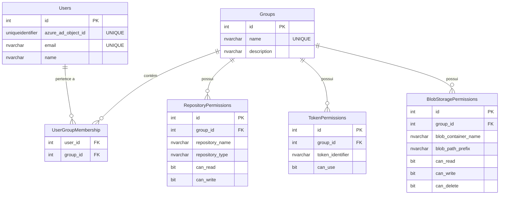

# Documentação do Esquema de Banco de Dados para RBAC

Este documento detalha a estrutura do banco de dados projetada para implementar o sistema de **Controle de Acesso Baseado em Funções (RBAC)**. O modelo é centrado no conceito de **Grupos** (roles), aos quais são atribuídas **Permissões** específicas para acessar diferentes recursos. Os **Usuários**, por sua vez, são associados a esses grupos, herdando assim todas as permissões concedidas.

## Diagrama de Relacionamento de Entidades (ER)

O diagrama abaixo ilustra como as tabelas se conectam para formar o sistema RBAC. Plataformas como GitHub e GitLab renderizarão este diagrama automaticamente.



---

## Detalhamento das Tabelas

### 1. Tabela `Groups`
Esta é a tabela central do modelo, representando as "funções" (roles) do sistema. As permissões são atribuídas diretamente aos grupos.

**Propósito:** Armazenar os diferentes grupos de usuários, como "Administradores", "Desenvolvedores" ou "Auditores".

**Definição SQL:**
```sql
-- Armazena os grupos de permissões, como "Administrators", "Developers".
CREATE TABLE Groups (
    id INT PRIMARY KEY IDENTITY(1,1),
    name NVARCHAR(100) NOT NULL UNIQUE,
    description NVARCHAR(255) NULL
);
```

#### Colunas
* `id` (INT, PK): Identificador único para cada grupo.
* `name` (NVARCHAR, UNIQUE): O nome do grupo, que deve ser único (ex: "Administrators").
* `description` (NVARCHAR): Uma breve descrição da finalidade do grupo.

---

### 2. Tabela `Users`
Esta tabela armazena as informações dos usuários, criando um vínculo entre a identidade do Azure AD e o sistema interno.

**Propósito:** Mapear um usuário autenticado via Azure AD para um registro interno na aplicação.

**Definição SQL:**
```sql
-- Mapeia o usuário do Azure AD para um ID interno na nossa aplicação.
CREATE TABLE Users (
    id INT PRIMARY KEY IDENTITY(1,1),
    azure_ad_object_id UNIQUEIDENTIFIER NOT NULL UNIQUE, -- O Object ID (oid) do token JWT
    email NVARCHAR(255) NOT NULL UNIQUE,
    name NVARCHAR(255) NOT NULL
);
```

#### Colunas
* `id` (INT, PK): Identificador numérico único para o usuário no sistema.
* `azure_ad_object_id` (UNIQUEIDENTIFIER, UNIQUE): O **ID do Objeto** (claim `oid`) extraído do token JWT do Azure AD. É a chave para vincular o login à nossa base de dados.
* `email` (NVARCHAR, UNIQUE): O e-mail do usuário.
* `name` (NVARCHAR): O nome de exibição do usuário.

---

### 3. Tabela `UserGroupMembership`
Esta é uma tabela de junção (ou "ponte") que estabelece a relação muitos-para-muitos entre usuários e grupos.

**Propósito:** Definir a quais grupos cada usuário pertence.

**Definição SQL:**
```sql
-- Tabela de junção para mapear quais usuários pertencem a quais grupos (relação N:N).
CREATE TABLE UserGroupMembership (
    user_id INT NOT NULL,
    group_id INT NOT NULL,
    PRIMARY KEY (user_id, group_id), -- Chave primária composta para evitar duplicatas
    FOREIGN KEY (user_id) REFERENCES Users(id) ON DELETE CASCADE,
    FOREIGN KEY (group_id) REFERENCES Groups(id) ON DELETE CASCADE
);
```

#### Colunas
* `user_id` (INT, FK): Chave estrangeira que referencia `Users(id)`.
* `group_id` (INT, FK): Chave estrangeira que referencia `Groups(id)`.
* A **chave primária composta** `(user_id, group_id)` garante que um usuário não possa ser adicionado ao mesmo grupo mais de uma vez.

---

### 4. Tabela `RepositoryPermissions`
Define as permissões de acesso a repositórios de código-fonte (GitHub, Azure DevOps, etc.).

**Propósito:** Controlar quais grupos podem realizar operações de leitura (`git pull`) ou escrita (`git push`, criar PRs) em repositórios específicos.

**Definição SQL:**
```sql
-- Define quais grupos podem ler/escrever em quais repositórios.
CREATE TABLE RepositoryPermissions (
    id INT PRIMARY KEY IDENTITY(1,1),
    group_id INT NOT NULL,
    repository_name NVARCHAR(255) NOT NULL, -- Ex: "projeto-cliente/repo-principal"
    repository_type NVARCHAR(50) NOT NULL,   -- Ex: "github", "azuredevops"
    can_read BIT NOT NULL DEFAULT 0,
    can_write BIT NOT NULL DEFAULT 0,
    FOREIGN KEY (group_id) REFERENCES Groups(id) ON DELETE CASCADE,
    -- Garante que não haja regras duplicadas para o mesmo grupo/repositório
    CONSTRAINT UQ_RepositoryPermission UNIQUE (group_id, repository_name, repository_type)
);
```

#### Colunas
* `id` (INT, PK): Identificador único da regra de permissão.
* `group_id` (INT, FK): O grupo ao qual esta permissão se aplica.
* `repository_name` (NVARCHAR): O nome completo do repositório (ex: "organizacao/meu-projeto").
* `repository_type` (NVARCHAR): A plataforma do repositório (ex: "github").
* `can_read` (BIT): Flag `1` (true) ou `0` (false) que indica permissão de leitura.
* `can_write` (BIT): Flag `1` (true) ou `0` (false) que indica permissão de escrita.

---

### 5. Tabela `TokenPermissions`
Gerencia o acesso a credenciais sensíveis, como tokens de API (PATs), que a aplicação usa para interagir com serviços externos.

**Propósito:** Controlar quais grupos de usuários podem acionar operações que utilizam um token de API específico, garantindo o princípio do menor privilégio.

**Definição SQL:**
```sql
-- Define quais grupos podem utilizar tokens de API específicos (ex: um PAT do GitHub).
CREATE TABLE TokenPermissions (
    id INT PRIMARY KEY IDENTITY(1,1),
    group_id INT NOT NULL,
    token_identifier NVARCHAR(255) NOT NULL, -- Um nome lógico para o token, ex: "github-pat-projeto-x"
    can_use BIT NOT NULL DEFAULT 0,
    FOREIGN KEY (group_id) REFERENCES Groups(id) ON DELETE CASCADE,
    CONSTRAINT UQ_TokenPermission UNIQUE (group_id, token_identifier)
);
```

#### Colunas
* `id` (INT, PK): Identificador único da regra de permissão.
* `group_id` (INT, FK): O grupo ao qual esta permissão se aplica.
* `token_identifier` (NVARCHAR): Um nome lógico e único para o token (ex: "github-pat-projeto-x"), que pode corresponder ao nome de um segredo no Azure Key Vault.
* `can_use` (BIT): Flag que indica se o grupo tem permissão para usar o token.

---

### 6. Tabela `BlobStoragePermissions`
Define regras de acesso granulares para arquivos e pastas dentro de um contêiner do Azure Blob Storage.

**Propósito:** Permitir ou negar acesso de leitura, escrita ou exclusão a caminhos específicos no armazenamento de blobs, ideal para relatórios ou logs que diferentes equipes podem acessar.

**Definição SQL:**
```sql
-- Define permissões granulares de acesso a pastas dentro de um container.
CREATE TABLE BlobStoragePermissions (
    id INT PRIMARY KEY IDENTITY(1,1),
    group_id INT NOT NULL,
    blob_container_name NVARCHAR(100) NOT NULL,
    blob_path_prefix NVARCHAR(512) NULL, -- NULL ou '' significa a raiz do container
    can_read BIT NOT NULL DEFAULT 0,
    can_write BIT NOT NULL DEFAULT 0,
    can_delete BIT NOT NULL DEFAULT 0,
    FOREIGN KEY (group_id) REFERENCES Groups(id) ON DELETE CASCADE,
    CONSTRAINT UQ_BlobStoragePermission UNIQUE (group_id, blob_container_name, blob_path_prefix)
);
```

#### Colunas
* `id` (INT, PK): Identificador único da regra de permissão.
* `group_id` (INT, FK): O grupo ao qual esta permissão se aplica.
* `blob_container_name` (NVARCHAR): O nome do contêiner no Azure Blob Storage.
* `blob_path_prefix` (NVARCHAR): O "caminho" ou "pasta" dentro do contêiner. Um valor nulo ou vazio (`''`) aplica a permissão à raiz do contêiner.
* `can
