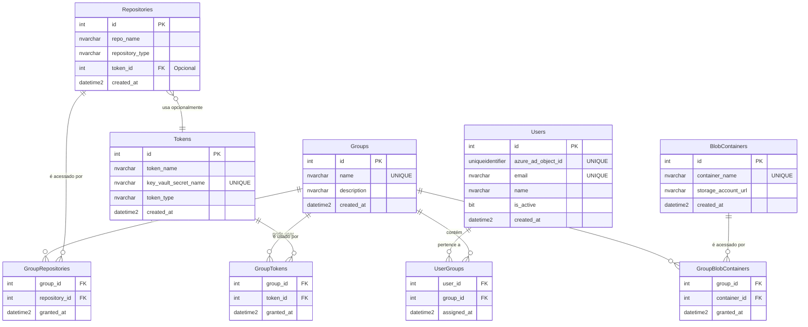

# Documentação do Esquema de Banco de Dados para RBAC (v2.0)

Este documento detalha a versão 2.0 do esquema de banco de dados para o sistema de **Controle de Acesso Baseado em Funções (RBAC)**. Este é um modelo mais normalizado e robusto, projetado para oferecer maior integridade de dados, clareza nas permissões e capacidade de auditoria.

O princípio central permanece: **Usuários** são membros de **Grupos**, e as permissões de acesso aos recursos (`Tokens`, `Repositories`, `BlobContainers`) são concedidas a esses **Grupos**.

## Diagrama de Relacionamento de Entidades (ER)

O diagrama abaixo ilustra a nova estrutura, mostrando as tabelas de inventário de recursos e as tabelas de junção que as conectam aos grupos.



---

## Detalhamento das Tabelas

As tabelas são divididas em duas categorias: **Entidades Principais** (os "substantivos" do sistema) e **Tabelas de Junção** (onde as relações e permissões são definidas).

### Tabelas de Entidades Principais

#### 1. Tabela `Users`
Mapeia um usuário do Azure AD para um registro interno na aplicação, controlando seu estado.

**Propósito:** Representar os usuários e seu status no sistema.

**Definição SQL:**
```sql
CREATE TABLE Users (
    id INT PRIMARY KEY IDENTITY(1,1),
    azure_ad_object_id UNIQUEIDENTIFIER NOT NULL UNIQUE,
    email NVARCHAR(255) NOT NULL UNIQUE,
    name NVARCHAR(255) NOT NULL,
    is_active BIT NOT NULL DEFAULT 1,
    created_at DATETIME2 NOT NULL DEFAULT GETUTCDATE()
);
```

**Colunas:**
* `id` (INT, PK): Identificador interno único.
* `azure_ad_object_id` (UNIQUEIDENTIFIER, UNIQUE): O **ID do Objeto** (claim `oid`) do token JWT, usado para vincular o login ao usuário.
* `email` (NVARCHAR, UNIQUE): E-mail do usuário.
* `name` (NVARCHAR): Nome de exibição do usuário.
* `is_active` (BIT): Flag para ativar ou desativar o acesso de um usuário sem excluí-lo.
* `created_at` (DATETIME2): Data e hora de criação do registro.

---

#### 2. Tabela `Groups`
Armazena os papéis/funções aos quais as permissões serão concedidas.

**Propósito:** Agrupar usuários para facilitar o gerenciamento de permissões.

**Definição SQL:**
```sql
CREATE TABLE Groups (
    id INT PRIMARY KEY IDENTITY(1,1),
    name NVARCHAR(100) NOT NULL UNIQUE,
    description NVARCHAR(255) NULL,
    created_at DATETIME2 NOT NULL DEFAULT GETUTCDATE()
);
```
**Colunas:**
* `id` (INT, PK): Identificador interno do grupo.
* `name` (NVARCHAR, UNIQUE): Nome único do grupo (ex: `Administrators`, `Developers-ProjectX`).
* `description` (NVARCHAR): Descrição da finalidade do grupo.
* `created_at` (DATETIME2): Data e hora de criação do grupo.

---

#### 3. Tabela `Tokens`
Funciona como um inventário de tokens e segredos gerenciados pela aplicação.

**Propósito:** Catalogar as credenciais que o sistema pode usar, armazenando uma referência segura a elas.

⚠️ **Importante:** Esta tabela **NÃO** armazena o valor do token. Ela armazena o nome do segredo correspondente no **Azure Key Vault**.

**Definição SQL:**
```sql
CREATE TABLE Tokens (
    id INT PRIMARY KEY IDENTITY(1,1),
    token_name NVARCHAR(255) NOT NULL,
    key_vault_secret_name NVARCHAR(255) NOT NULL UNIQUE,
    token_type NVARCHAR(50) NOT NULL,
    created_at DATETIME2 NOT NULL DEFAULT GETUTCDATE()
);
```
**Colunas:**
* `id` (INT, PK): Identificador interno do token.
* `token_name` (NVARCHAR): Nome amigável para o token (ex: "PAT do GitHub para o Projeto Alfa").
* `key_vault_secret_name` (NVARCHAR, UNIQUE): O nome do segredo no Azure Key Vault onde o valor real está armazenado.
* `token_type` (NVARCHAR): Tipo do token para uso na lógica da aplicação (ex: `github_pat`, `azure_devops_pat`).
* `created_at` (DATETIME2): Data de registro do token.

---

#### 4. Tabela `Repositories`
Inventário de todos os repositórios de código-fonte que são gerenciados pelo sistema.

**Propósito:** Criar uma lista canônica de repositórios para que as permissões possam ser vinculadas a um ID, em vez de um nome de string propenso a erros.

**Definição SQL:**
```sql
CREATE TABLE Repositories (
    id INT PRIMARY KEY IDENTITY(1,1),
    repo_name NVARCHAR(255) NOT NULL,
    repository_type NVARCHAR(50) NOT NULL,
    token_id INT NULL,
    created_at DATETIME2 NOT NULL DEFAULT GETUTCDATE(),
    FOREIGN KEY (token_id) REFERENCES Tokens(id) ON DELETE SET NULL,
    CONSTRAINT UQ_Repository UNIQUE (repo_name, repository_type)
);
```
**Colunas:**
* `id` (INT, PK): Identificador interno do repositório.
* `repo_name` (NVARCHAR): Nome completo do repositório (ex: "organizacao/nome-do-repo").
* `repository_type` (NVARCHAR): Plataforma do repositório (ex: `github`, `azuredevops`).
* `token_id` (INT, FK, Opcional): Vincula um token padrão para ser usado ao acessar este repositório.
* `created_at` (DATETIME2): Data de registro do repositório.

---

#### 5. Tabela `BlobContainers`
Inventário dos contêineres do Azure Blob Storage gerenciados pelo sistema.

**Propósito:** Criar uma lista canônica de contêineres para associar permissões.

**Definição SQL:**
```sql
CREATE TABLE BlobContainers (
    id INT PRIMARY KEY IDENTITY(1,1),
    container_name NVARCHAR(100) NOT NULL UNIQUE,
    storage_account_url NVARCHAR(512) NOT NULL,
    created_at DATETIME2 NOT NULL DEFAULT GETUTCDATE()
);
```
**Colunas:**
* `id` (INT, PK): Identificador interno do contêiner.
* `container_name` (NVARCHAR, UNIQUE): Nome do contêiner (ex: `relatorios`, `logs-auditoria`).
* `storage_account_url` (NVARCHAR): URL base da conta de armazenamento (ex: "https://seustorage.blob.core.windows.net/").
* `created_at` (DATETIME2): Data de registro do contêiner.

---

### Tabelas de Junção (Permissões)

Estas tabelas conectam os grupos aos recursos. A **existência de uma linha** em qualquer uma dessas tabelas **concede a permissão**.

#### 6. Tabela `UserGroups`
Associa usuários a grupos.

**Definição SQL:**
```sql
CREATE TABLE UserGroups (
    user_id INT NOT NULL,
    group_id INT NOT NULL,
    assigned_at DATETIME2 NOT NULL DEFAULT GETUTCDATE(),
    PRIMARY KEY (user_id, group_id),
    FOREIGN KEY (user_id) REFERENCES Users(id) ON DELETE CASCADE,
    FOREIGN KEY (group_id) REFERENCES Groups(id) ON DELETE CASCADE
);
```

---

#### 7. Tabela `GroupTokens`
Concede a um grupo permissão para **usar** um token específico.

**Definição SQL:**
```sql
CREATE TABLE GroupTokens (
    group_id INT NOT NULL,
    token_id INT NOT NULL,
    granted_at DATETIME2 NOT NULL DEFAULT GETUTCDATE(),
    PRIMARY KEY (group_id, token_id),
    FOREIGN KEY (group_id) REFERENCES Groups(id) ON DELETE CASCADE,
    FOREIGN KEY (token_id) REFERENCES Tokens(id) ON DELETE CASCADE
);
```

---

#### 8. Tabela `GroupRepositories`
Concede a um grupo permissão para **acessar** um repositório específico.

**Definição SQL:**
```sql
CREATE TABLE GroupRepositories (
    group_id INT NOT NULL,
    repository_id INT NOT NULL,
    granted_at DATETIME2 NOT NULL DEFAULT GETUTCDATE(),
    PRIMARY KEY (group_id, repository_id),
    FOREIGN KEY (group_id) REFERENCES Groups(id) ON DELETE CASCADE,
    FOREIGN KEY (repository_id) REFERENCES Repositories(id) ON DELETE CASCADE
);
```

---

#### 9. Tabela `GroupBlobContainers`
Concede a um grupo permissão para **acessar** um contêiner de blob específico.

**Definição SQL:**
```sql
CREATE TABLE GroupBlobContainers (
    group_id INT NOT NULL,
    container_id INT NOT NULL,
    granted_at DATETIME2 NOT NULL DEFAULT GETUTCDATE(),
    PRIMARY KEY (group_id, container_id),
    FOREIGN KEY (group_id) REFERENCES Groups(id) ON DELETE CASCADE,
    FOREIGN KEY (container_id) REFERENCES BlobContainers(id) ON DELETE CASCADE
);
```
---

## Índices e Otimização

Para garantir que as consultas de verificação de permissão sejam rápidas e eficientes, foram criados índices em colunas frequentemente usadas em cláusulas `WHERE` e `JOIN`.

* `IX_Users_AzureAdObjectId`: Essencial para encontrar rapidamente o usuário no banco de dados a partir do `oid` do token JWT em cada requisição.
* `IX_UserGroups_GroupId` (e similares): Acelera a busca de todos os usuários em um grupo ou todas as permissões de um grupo.
* `IX_Repositories_NameType`: Otimiza a busca por um repositório específico pelo seu nome e tipo, evitando a varredura completa da tabela (`table scan`).
