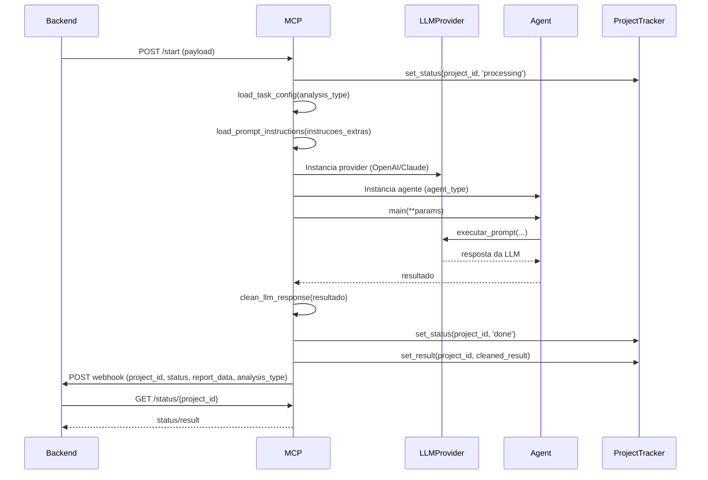

# MCP Flow - Documentação Técnica

Este documento descreve o fluxo completo do MCP dinâmico, desde a recepção da requisição até o envio do webhook ao backend, incluindo os principais componentes e etapas do processo.

## 1. Recepção da Requisição
- O MCP recebe uma requisição HTTP POST do backend no endpoint `/start`.
- O payload é validado usando o modelo Pydantic `MCPRequest`, que inclui os campos:
  - `project_id` (str)
  - `analysis_type` (str)
  - `instrucoes_extras` (Optional[str])
  - `arquivo_docx` (Optional[str])
  - `nome_projeto` (Optional[str])
  - `usuario_executor` (Optional[str])

## 2. Tracking por Project ID
- Todo o tracking da requisição é feito usando o `project_id`, permitindo múltiplas requisições paralelas (uma por projeto).
- O status e o resultado de cada projeto são armazenados pelo `ProjectTracker`.

## 3. Carregamento de Configuração
- O arquivo `config_tasks.yaml` é aberto.
- Busca-se a chave correspondente ao `analysis_type` recebido.
- O dicionário encontrado deve conter:
  - `model_name`: indica o provedor de LLM a ser utilizado (ex: OpenAI, Claude).
  - `agent_type`: tipo do agente que será utilizado.
  - `instrucoes_extras`: nome do arquivo markdown (.md) que será lido na pasta `tools/prompts`.

## 4. Carregamento de Instruções Padrão
- O arquivo markdown indicado por `instrucoes_extras` é lido da pasta `tools/prompts`.
- O conteúdo é enviado para o agente como variável `instrucoes_padrao`.

## 5. Montagem da Requisição para o Agente
- Utiliza-se a classe `LLMRequestBuilder` para montar o dicionário de parâmetros que será enviado ao agente, incluindo:
  - `project_id`
  - `analysis_type`
  - `instrucoes_extras`
  - `arquivo_docx`
  - `nome_projeto`
  - `usuario_executor`
  - `model_name` (do config)
  - `instrucoes_padrao` (do markdown)

## 6. Instanciação do Provider LLM
- O código decide qual provider de LLM instanciar (OpenAI ou Claude) com base em `model_name`.

## 7. Execução da Análise
- O agente correto é instanciado usando o `AgentFactory` com base em `agent_type`.
- O método `main` do agente é chamado com os parâmetros montados.

## 8. Limpeza da Resposta
- A resposta bruta do agente é processada pela função `clean_llm_response`, que extrai o campo relevante e remove marcadores de código markdown.

## 9. Atualização de Status e Envio de Webhook
- O status do projeto é atualizado para 'done' usando `ProjectTracker`.
- O resultado limpo é salvo.
- Um webhook é enviado ao backend com o payload atualizado, incluindo:
  - `project_id`
  - `status: 'done'`
  - `report_data: cleaned_result`
  - `analysis_type`

## 10. Consulta de Status
- O endpoint `GET /status/{project_id}` retorna o status atual e o resultado do projeto.

## Diagrama de Sequência (Opcional)

