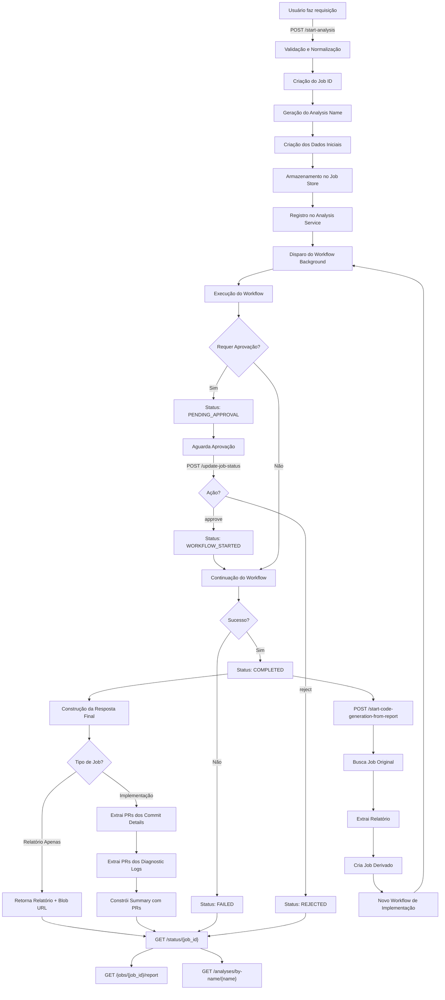
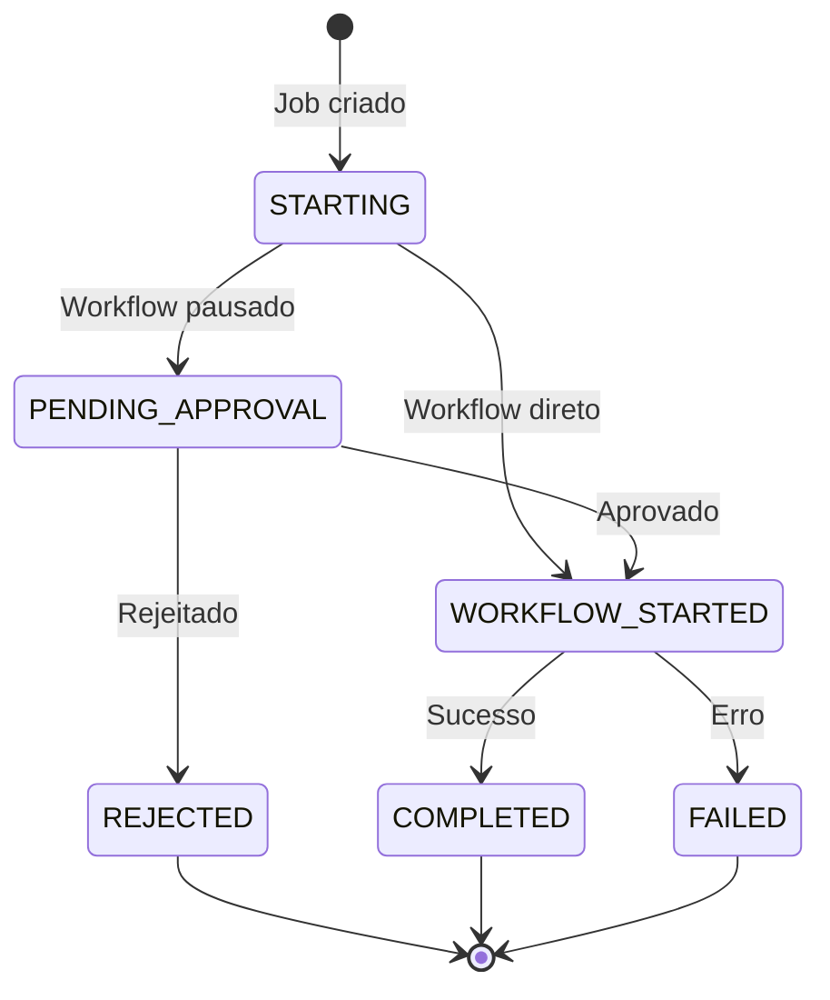

# MCP Server FastAPI

Este documento descreve o funcionamento macro do servidor FastAPI (`mcp_server_fastapi.py`) utilizado para orquestrar agentes de IA e gerenciar jobs de análise e geração de código.

## Visão Geral

O MCP Server FastAPI é um servidor robusto que utiliza Redis para orquestrar agentes de IA, fornecendo uma API REST para gerenciar workflows de análise de código e geração automática de implementações.

## Principais Componentes

### Classes de Modelo

- **JobStatus:** Define os estados possíveis de um job (`starting`, `pending_approval`, `workflow_started`, `completed`, `failed`, `rejected`)
- **JobFields:** Constantes para os campos utilizados nos dados dos jobs
- **JobActions:** Ações disponíveis para atualização de jobs (`approve`, `reject`)
- **StartAnalysisPayload:** Modelo de dados para iniciar uma nova análise
- **UpdateJobPayload:** Modelo para aprovação/rejeição de jobs
- **FinalStatusResponse:** Resposta completa do status de um job
- **PullRequestSummary:** Resumo dos Pull Requests criados

### Funções Utilitárias

- **_validate_and_normalize_gitlab_repo_name():** Valida e normaliza nomes de repositórios GitLab (Project ID ou path completo)
- **_normalize_repo_name_by_type():** Normaliza nomes de repositório baseado no tipo (GitHub, GitLab, Azure)
- **_generate_analysis_name():** Gera nome único para análise quando não fornecido
- **_create_initial_job_data():** Cria estrutura inicial de dados do job
- **_build_completed_response():** Constrói resposta final para jobs completados

### Container de Dependências

Utiliza o `DependencyContainer` para gerenciar:
- **WorkflowRegistryService:** Registro de tipos de análise válidos
- **JobStore:** Armazenamento e recuperação de jobs
- **AnalysisNameService:** Mapeamento entre nomes de análise e job IDs
- **WorkflowOrchestrator:** Execução de workflows

## Endpoints da API

### POST /start-analysis
**Descrição:** Inicia uma nova análise, criando um job e disparando o workflow em background.

**Parâmetros principais:**
- `repo_name`: Nome do repositório
- `projeto`: Nome do projeto para organização
- `analysis_type`: Tipo de análise a ser executada
- `repository_type`: Tipo do repositório (github, gitlab, azure)
- `branch_name`: Branch específica (opcional)
- `instrucoes_extras`: Instruções adicionais (opcional)
- `usar_rag`: Utilizar RAG na análise
- `gerar_relatorio_apenas`: Gerar apenas relatório sem implementação
- `model_name`: Modelo de LLM específico (opcional)
- `arquivos_especificos`: Lista de arquivos específicos (opcional)
- `analysis_name`: Nome personalizado da análise (opcional)

### POST /update-job-status
**Descrição:** Aprova ou rejeita um job que está pendente de aprovação.

**Ações disponíveis:**
- `approve`: Aprova e continua o workflow
- `reject`: Rejeita e encerra o processo

### GET /status/{job_id}
**Descrição:** Consulta o status atual do job, incluindo detalhes de conclusão, erros ou logs diagnósticos.

### GET /jobs/{job_id}/report
**Descrição:** Obtém o relatório de análise específico do job.

### GET /analyses/by-name/{analysis_name}
**Descrição:** Busca relatório por nome de análise personalizado.

### POST /start-code-generation-from-report/{analysis_name}
**Descrição:** Cria um novo job de implementação baseado em um relatório existente, derivando um job de análise para um job de geração de código.

## Diagrama Macro do Processo

## Fluxo de Estados do Job

## Tipos de Repositório Suportados

### GitHub
- Formato padrão: `owner/repository`
- Sem validação especial

### GitLab
- **Project ID (Recomendado):** Número único do projeto (ex: `123456`)
- **Path Completo:** Formato `namespace/projeto` (ex: `meugrupo/meuprojeto`)
- Validação rigorosa para evitar formatos inválidos

### Azure DevOps
- Formato padrão sem validação especial

## Características Técnicas

### Processamento Assíncrono
- Utiliza `BackgroundTasks` do FastAPI para execução não-bloqueante
- Workflows executados em paralelo sem impactar a responsividade da API

### Armazenamento de Estado
- Jobs armazenados no Redis via `JobStore`
- Mapeamento de nomes de análise para job IDs
- Persistência de logs diagnósticos e resultados

### Tratamento de Erros
- Validação rigorosa de payloads com Pydantic
- HTTPExceptions específicas para diferentes cenários
- Logs detalhados para debugging

### Middleware CORS
- Configurado para aceitar requisições de qualquer origem
- Suporte completo a credenciais e métodos HTTP

## Observações Importantes

1. **Fluxo de Aprovação:** Jobs podem pausar para aprovação humana antes de continuar
2. **Derivação de Jobs:** Relatórios podem gerar novos jobs de implementação automaticamente
3. **Flexibilidade de Modelos:** Suporte a diferentes modelos de LLM por job
4. **Rastreabilidade:** Cada análise possui nome único e histórico completo
5. **Robustez:** Tratamento específico para diferentes tipos de repositório e cenários de erro

O servidor foi projetado para ser escalável, mantendo estado consistente e fornecendo feedback detalhado sobre o progresso e resultados dos workflows de análise e implementação.
