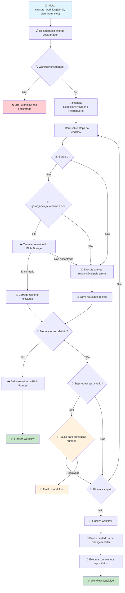

# Documentação do Workflow Orchestrator

## Visão Geral

O `WorkflowOrchestrator` é o componente central responsável por gerenciar e executar workflows de análise e refatoração de código de forma automatizada. Ele coordena a execução de diferentes agentes (revisor e processador), gerencia aprovações humanas, integra com sistemas de armazenamento (Blob Storage) e repositórios de código.

## Fluxo do Workflow

## Componentes Principais

### 1. WorkflowOrchestrator
**Responsabilidade:** Coordenação geral do workflow
- Gerencia a execução sequencial de steps
- Controla pausas para aprovação
- Integra com JobManager para persistência de estado
- Coordena salvamento de relatórios no Blob Storage

### 2. Agentes

#### Agente Revisor
- **Função:** Análise e geração de relatórios de código
- **Input:** Instruções do usuário + contexto de etapas anteriores
- **Output:** Relatório de análise estruturado

#### Agente Processador
- **Função:** Processamento e refatoração de código
- **Input:** Resultado de etapas anteriores (geralmente relatórios)
- **Output:** Plano de mudanças estruturado

### 3. Integrações

#### JobManager
- Persistência de estado do workflow
- Controle de status (running, pending_approval, completed)
- Armazenamento de resultados intermediários

#### Blob Storage
- Armazenamento de relatórios gerados
- Cache de relatórios para reutilização
- Controle via flag `gerar_novo_relatorio`

#### Repository Providers
- Integração com diferentes tipos de repositório (GitHub, Azure DevOps, etc.)
- Leitura de código-fonte
- Execução de commits e criação de PRs

## Fluxo de Execução Detalhado

### Fase 1: Inicialização
1. **Recuperação do Job:** Busca informações do job no JobManager
2. **Validação:** Verifica se o workflow existe no registry
3. **Preparação:** Configura RepositoryProvider e ReaderGeral

### Fase 2: Execução de Steps

#### Step 0 - Geração/Recuperação de Relatório
- **Verificação de Cache:** Se `gerar_novo_relatorio=False`, tenta ler do Blob Storage
- **Geração:** Se não encontrado ou `gerar_novo_relatorio=True`, executa agente revisor
- **Modo Relatório Apenas:** Se `gerar_relatorio_apenas=True`, finaliza aqui

#### Steps Subsequentes
- **Execução de Agentes:** Processa resultado da etapa anterior
- **Aplicação de Instruções:** Incorpora `instrucoes_extras` e `instrucoes_extras_aprovacao`
- **Controle de Aprovação:** Pausa execução se `requires_approval=True`

### Fase 3: Finalização
1. **Preenchimento de Dados:** Usa ChangesetFiller para estruturar mudanças
2. **Formatação:** Organiza dados em grupos de mudanças
3. **Commits:** Executa commits nos repositórios via repository providers
4. **Conclusão:** Atualiza status final no JobManager

## Configuração de Workflow

### Estrutura do Workflow Registry

{
  "analysis_type": {
    "steps": [
      {
        "agent_type": "revisor",
        "status_update": "analyzing_code",
        "requires_approval": true,
        "model_name": "gpt-4",
        "params": {}
      },
      {
        "agent_type": "processador",
        "status_update": "processing_changes",
        "requires_approval": false,
        "model_name": "gpt-4",
        "params": {}
      }
    ]
  }
}

### Parâmetros de Job
- `original_analysis_type`: Tipo de análise a ser executada
- `repository_type`: Tipo do repositório (github, azure_devops)
- `repo_name`: Nome do repositório
- `branch_name`: Branch de trabalho
- `instrucoes_extras`: Instruções adicionais do usuário
- `gerar_novo_relatorio`: Flag para controle de cache de relatórios
- `gerar_relatorio_apenas`: Flag para execução apenas do relatório
- `analysis_name`: Nome para identificação do relatório no Blob Storage

## Estados do Workflow

- **running:** Execução em andamento
- **pending_approval:** Pausado aguardando aprovação humana
- **populating_data:** Preenchendo dados finais
- **committing_to_github:** Executando commits
- **completed:** Concluído com sucesso
- **error:** Erro durante execução

## Tratamento de Erros

- **Job não encontrado:** Lança `ValueError`
- **Workflow não encontrado:** Lança `ValueError`
- **Resposta vazia da IA:** Reutiliza resultado anterior ou lança erro
- **Erros de execução:** Capturados e tratados via `JobManager.handle_job_error`

## Funcionalidades Especiais

### Reutilização de Relatórios
- Controle via `gerar_novo_relatorio=False`
- Busca automática no Blob Storage
- Fallback para geração via agente se não encontrado

### Aprovação Humana
- Pausa automática em steps marcados com `requires_approval=True`
- Suporte a `instrucoes_extras_aprovacao` para refinamentos
- Continuação via `execute_workflow` com `start_from_step`

### Modo Relatório Apenas
- Execução limitada ao step 0
- Ideal para análises exploratórias
- Salvamento automático no Blob Storage

### Múltiplos Commits
- Agrupamento inteligente de mudanças
- Criação de branches e PRs separados
- Suporte a diferentes repository providers
