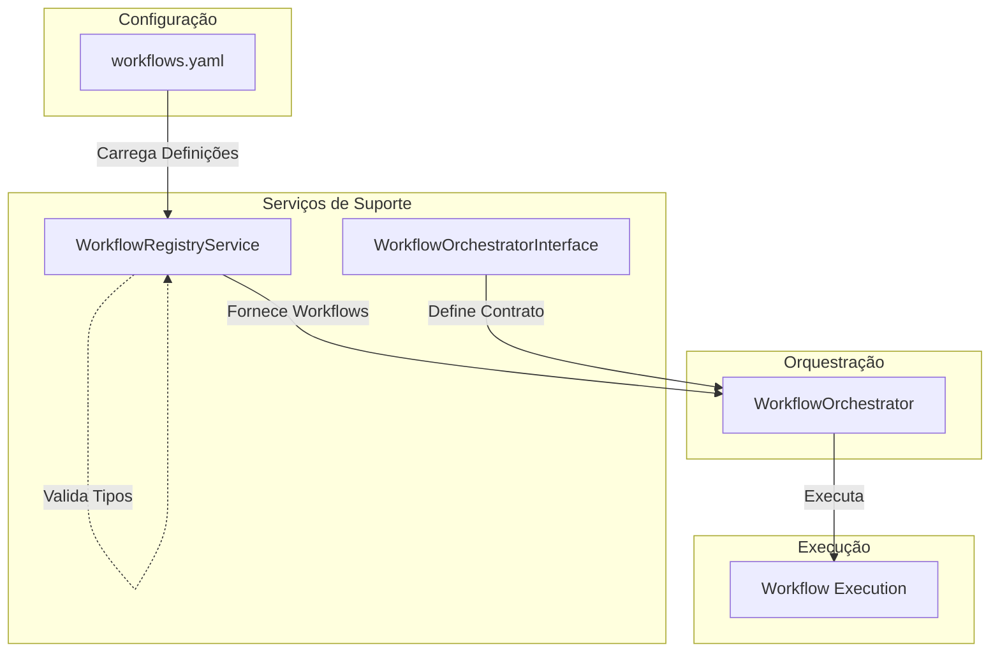

# Suporte de Workflow: Arquitetura e Interação

Este documento explica como os arquivos `workflow_registry_service.py` e `workflow_orchestrator_interface.py` suportam o funcionamento do `workflow_orchestrator`, detalhando suas responsabilidades e o fluxo de interação entre eles.

## 1. Descrição dos Componentes

### workflow_registry_service.py

O `WorkflowRegistryService` é responsável por:

- **Carregamento de Workflows:** Lê e processa arquivos YAML contendo definições de workflows
- **Cache Inteligente:** Mantém os workflows carregados em memória (`_workflow_registry`) para evitar recarregamentos desnecessários
- **Validação de Tipos:** Gera dinamicamente um enum (`ValidAnalysisTypes`) com base nas chaves dos workflows disponíveis
- **Tratamento de Erros:** Implementa fallback para diferentes formatos de YAML (streaming e carregamento único)
- **Interface de Acesso:** Fornece métodos públicos para acessar o registro de workflows e tipos válidos

**Principais Métodos:**
- `load_workflow_registry()`: Carrega workflows do arquivo YAML
- `get_valid_analysis_types()`: Retorna enum com tipos de análise válidos
- `get_workflow_registry()`: Interface pública para acessar workflows

### workflow_orchestrator_interface.py

Define a interface (contrato) que qualquer implementação de orquestrador de workflow deve seguir:

- **Padronização:** Estabelece métodos obrigatórios que implementações devem ter
- **Abstração:** Permite diferentes implementações do orquestrador mantendo compatibilidade
- **Documentação Implícita:** Serve como documentação viva dos métodos esperados
- **Testabilidade:** Facilita criação de mocks e testes unitários

### workflow_orchestrator.py

Implementa a lógica principal de orquestração:

- **Implementação da Interface:** Segue o contrato definido em `workflow_orchestrator_interface.py`
- **Integração com Registry:** Utiliza `WorkflowRegistryService` para acessar workflows disponíveis
- **Execução de Workflows:** Coordena a execução dos workflows conforme definições carregadas
- **Gerenciamento de Estado:** Controla o ciclo de vida da execução dos workflows

## 2. Fluxo de Interação

## 3. Processo Macro

### Fase 1: Inicialização
1. **Carregamento de Configuração:** O `WorkflowRegistryService` lê o arquivo `workflows.yaml`
2. **Processamento YAML:** Tenta carregamento em streaming, com fallback para carregamento único
3. **Cache de Workflows:** Armazena workflows em `_workflow_registry` para acesso rápido
4. **Geração de Tipos:** Cria enum `ValidAnalysisTypes` baseado nas chaves dos workflows

### Fase 2: Preparação
1. **Instanciação do Orquestrador:** `WorkflowOrchestrator` é criado seguindo a interface definida
2. **Integração com Registry:** Orquestrador obtém referência ao `WorkflowRegistryService`
3. **Validação de Dependências:** Verifica se todos os componentes necessários estão disponíveis

### Fase 3: Execução
1. **Consulta de Workflows:** Orquestrador consulta workflows disponíveis via registry
2. **Seleção de Workflow:** Escolhe workflow apropriado baseado no tipo de análise solicitado
3. **Execução Coordenada:** Executa o workflow seguindo as definições carregadas
4. **Gerenciamento de Estado:** Monitora e controla o progresso da execução

## 4. Benefícios da Arquitetura

### Separação de Responsabilidades
- **Registry:** Focado apenas em carregar e disponibilizar workflows
- **Interface:** Define contratos claros sem implementação
- **Orchestrator:** Concentra-se na lógica de execução

### Flexibilidade
- Workflows podem ser modificados via YAML sem alteração de código
- Diferentes implementações de orquestrador podem coexistir
- Fácil extensão para novos tipos de análise

### Manutenibilidade
- Componentes independentes facilitam testes unitários
- Cache inteligente melhora performance
- Tratamento robusto de erros em carregamento de arquivos

### Escalabilidade
- Registry pode ser estendido para múltiplas fontes de workflow
- Interface permite implementações otimizadas para diferentes cenários
- Arquitetura suporta workflows complexos e aninhados

---

> **Nota:** Esta documentação deve ser mantida atualizada conforme novos componentes ou alterações forem introduzidas no fluxo de orquestração de workflows.
